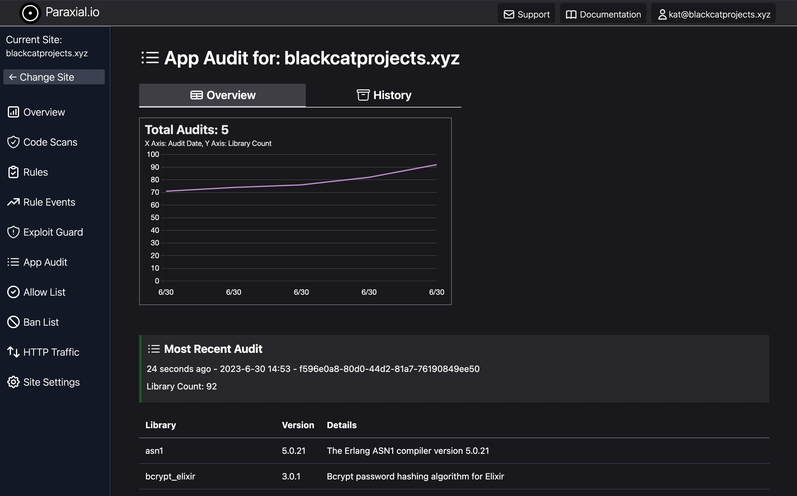

# App Audit

A common pattern in vulnerability disclosure is that a library has a bad security problem, and you want to check what version is running in production. The syntax of most dependency specification files (including Elixir's mix) means the exact version running cannot be determined from the file alone. Consider a library where `2.0.3` is not vulnerable, but `2.0.4` is. The project's mix file has `"~> 2.0.0"`, meaning `">= 2.0.0 and < 2.1.0"`. The reply to "Are we vulnerable right now?" is an uncomfortable "Maybe, there is not enough information". 
  
Even worse, the security team may decide to search through source code repos (Github, Gitlab, etc) for the relevant library. No matches are found but the vulnerability is present, because it is a sub-dependency of a dependency. While the `mix.lock` file for an Elixir project may be in Github, there is no guarantee that file matches what is running in production. 

## App Audit Configuration 

App Audit provides a list of each library in an Elixir application, at runtime, for use in security work. App Audit was introduced with the Paraxial.io `v2.5.0` agent. You must upgrade to `v2.5.0` or later to use this feature. AppAudit is enabled by default, to disable App Audit set the configuration to `false`:

```
config :paraxial,
  paraxial_api_key: System.get_env("PARAXIAL_API_KEY"),  # Required
  app_audit: false                                       # Disable AppAudit 
```

App Audit is enabled by default.

When the Paraxial.io agent is started, it automatically collects and uploads the relevant data to the Paraxial.io backend. A maximum of five audits are stored per day, to avoid excessive reports. 


