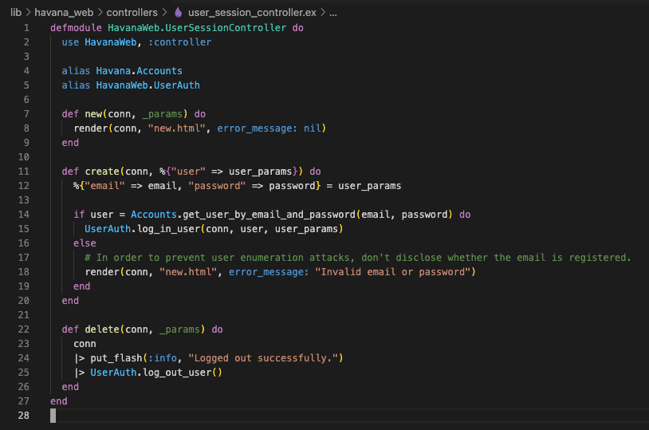

# Bot Defense

**Definitions**

**Site** - An Elixir/Phoenix/Plug web application that has the Paraxial agent installed and running. You create a site through the Paraxial web interface, provide the site API key to the Paraxial agent, and a connection is established between the Paraxial server and your application. A site has many rules, allowed IP addresses, banned IP address, and site members.

**Rule** - A user defined condition such as, "If one IP address sends > 20 POST requests to `/users/log_in` in a period of 5 seconds, create an alert and ban the IP address." A benefit of Paraxial over traditional systems is that if an IP sending hundreds of requests per second, it will only be permitted to send 20 requests, the 21st will be banned. Compare this with a periodic database query, which would allow hundreds of requests before banning the client.

**Rule Event** - When an IP address matches a rule, such as, "If an IP sends > 20 POST requests to `/users/log_in` in a period of 5 seconds, alert and ban", a rule event is created. The rule event contains information about what caused the rule to be triggered.

**Allow List** - A list of IP prefixes defined by the user. If an IP matches a prefix on this list, it will always be allowed through. Supports IPv4 and IPv6 prefixes.

**Ban List** - Similar to Allow List, matching requests will never succeed. Supports IPv4 and IPv6 prefixes.

**Site Admin** - Has full control over the site.

**Site User** - Limited control over a site, for example this user cannot delete the site.


## Defining Rules
Paraxial.io allows users to define "Rules", which are conditions in their web application related to incoming HTTP traffic. The following are examples of rules:

1. `If an IP sends > 5 POST requests to /accounts/new_user in a 20 second period, create an alert.`

2. `If an IP sends > 10 requests of any HTTP method to /projects/*/export in a 12 second period, create an alert and ban the IP address.`

3. `If an IP sends > 100 requests of any HTTP method to any path in a 5 second period, ban the IP address.`

The purpose of defining rules is to prevent a malicious client from sending an excessive number of unwanted requests. Some examples of requests that you may want to throttle may be related to:

- Login attempts
- New account creation
- Credit card transactions
- Email sending
- Expensive computation
- Excessive total requests (scraping, vulnerability scanning)
- Denial of service attacks

To create a rule, navigate to:

`app.paraxial.io/site/:your_site/new_rule`

You should see a form that says `Create new rule for :your_site`, with some fields. These are:

1. `Rule name` - A user provided string, it should be a descriptive comment on what the rule intends to do.
2. `N requests` - The number of requests one IP address can make in the given time period before matching the rule.
3. `Time period in seconds` - If you wish to limit login requests to 10 every 5 seconds, this value should be 5.
4. `Path` - The path of the incoming request. Uses a custom pattern matching language detailed below.
5. `HTTP Methods` - Examples include GET, PUT, POST. Uses a custom pattern matching language detailed below.
6. `On trigger` - When the rule is matched, you may create an alert, ban the IP, or do both.

Example Rule Creation

To create the rule `If an IP sends > 5 POST requests to /accounts/new_user in a 20 second period, create an alert and ban the IP address`, the following form values are used:

1. `Rule name` - This is an arbitrary value, written to be understood by users of Paraxial.io. You could name this "Alert and ban on excessive logins in short period", or "ATO > 5 in 20s to /accounts/new_user". The behavior of the rule is independent of this string, similar to comments in a programming language. 

2. `N requests` - `5`

3. `Time period in seconds` - `20`

4. `Path` - `/accounts/new_user` - This must be entered exactly as provided here. If your value does not start with a `/`, it will be rejected. More details are below on how path matching works.

5. `HTTP Methods` - `POST` - This must be entered exactly as provided here. More details on http method matching below.

6. `On trigger` - `Create an alert and ban the IP`

<br>

**Field Details**

**N requests**
`N requests` must be > 0 and < 999. 

**Time period in seconds**
`Time period in seconds` must be > 0 and < 86,400.

**Path**
The "Path" field uses a custom language for matching on paths. Examples are:

---
Path `*` - Match any path.

Matching:
```
paraxial.io/new_user
paraxial.io/site/paraxial.io/settings
paraxial.io/site/paraxial.io/edit_users/update
```

---
Path `/new_user` - Only matching incoming requests for the route `new_user`.

Matching:
```
paraxial.io/new_user
paraxial.io/new_user/
paraxial.io/new_user//
paraxial.io/new_user///
```

Will not match:
```
paraxial.io/new_user/a/new_user
paraxial.io/new_user/!
paraxial.io/new_user/a
```

---
Path `/site/*/settings` - Matching incoming requests for the route `/site/:any_value/settings`.

Matching:
```
paraxial.io/site/paraxial.io/settings
paraxial.io/site/paraxial.io/settings/
paraxial.io/site/customsitehere.com/settings
paraxial.io/site/customsitehere.com/settings/
```

Will not match:
```
paraxial.io/site/paraxial.io
paraxial.io/site/paraxial.io/settings/edit_users
```

---
Path `/site/*/settings/*` - Matching incoming requests for the route `/site/:any_value/settings/:any_value`.

Matching:
```
paraxial.io/site/paraxial.io/edit_users
paraxial.io/site/paraxial.io/list_users
```

Will not match:
```
paraxial.io/site/paraxial.io/edit_users/update
paraxial.io/site/paraxial.io
```

<br>

**HTTP Methods**

The `HTTP Methods` field takes a list of comma separated HTTP method names, such as: 

`GET, POST, PUT`

for use in rule matching. It also supports the wildcard `*` character, to match all HTTP methods. These are:

`GET, HEAD, POST, PUT, DELETE, CONNECT, OPTIONS, TRACE, PATCH`

To match all HTTP methods, input: `*`

To match GET only, input: `GET`

To match GET and POST, input: `GET, POST`

To match GET, POST, and PUT, input: `GET, POST, PUT`

<br>

**Rule Events**
The rule events page lists useful information about why an IP address matched a rule. This includes:

1. The rule that was matched
2. How many requests the IP sent in the rule time period
3. If the IP is currently on the allow or ban lists
4. Associated login attempts from the IP, if `paraxial_login_user_name` and `paraxial_login_success` assigns are in use by your application
5. The matching HTTP requests, with timestamps  

<br>

**Allow/Block List**
The IP block and allow lists support IPv4 and IPv6 prefixes. Examples include:

- `3.5.140.0/22`
- `2600:1f14:fff:f800::/56`


## Exclude data collection for specific routes

The pricing on Paraxial.io is by the number of good events sent by the agent to the backend. A good event means one HTTP request sent to your web app. So if 5 users send a total of 50 requests, that's 50 good events. If a spammer sends 5,000 blocked requests, those don't count. By default, the agent sends all HTTP requests to the backend.

To only collect data for specific routes, set your configuration at compile time to the code below, by editing your `config/dev.exs`, `config/test.exs`, and `config/prod.exs` files. 

Do NOT set `only:` or `except:` at runtime, the agent uses metaprogramming to generate code at compile time. If you set `only:` or `except:` at runtime, the agent will ignore the config and send data for all routes. As of `2.0.0`, you will get an error (see below).

To have the agent only send data to the backend for the following:

- GET /users/log_in
- POST /users/log_in
- GET /users/:id/settings

```elixir
config :paraxial,
  paraxial_api_key: System.get_env("PARAXIAL_API_KEY"),  
  ... 
  only: [
    %{path: "/users/log_in", method: "GET"},
    %{path: "/users/log_in", method: "POST"},
    %{path: "/users/:id/settings", method: "POST"}
  ]
```

To send events for all routes, except the following:

- GET /health_check
- GET /users/:id/status

```elixir
config :paraxial,
  paraxial_api_key: System.get_env("PARAXIAL_API_KEY"),  
  ... 
  except: [
    %{path: "/health_check", method: "GET"},
    %{path: "/users/:id/status", method: "GET"}
  ]
```

After changing `only/except` in your compile time configuration, you must run:

```
mix deps.compile paraxial --force
```

Or you will get an error:

```
@ air % mix phx.server
ERROR! the application :paraxial has a different value set for key :except during runtime compared to compile time. Since this application environment entry was marked as compile time, this difference can lead to different behaviour than expected:

  * Compile time value was not set
  * Runtime value was set to: [%{method: "GET", path: "/health_check"}, %{method: "GET", path: "/users/:id/status"}]

To fix this error, you might:

  * Make the runtime value match the compile time one

  * Recompile your project. If the misconfigured application is a dependency, you may need to run "mix deps.compile paraxial --force"

  * Alternatively, you can disable this check. If you are using releases, you can set :validate_compile_env to false in your release configuration. If you are using Mix to start your system, you can pass the --no-validate-compile-env flag
```

Note that you should only define rules for routes that have collection enabled. If you define a rule for a route, but disable collection for it, the rule will not work correctly. 

If an attacker is banned due to triggering a rule, the attacker will be banned from all routes in your application, even if collection is not enabled for those routes.

## LiveView 

- In a LiveView app, you want to rate limit an action that is triggered via a websocket 
- In a Phoenix app with multiple endpoints, you want to rate limit requests with a specific `conn.host`. 

Paraxial.io agent `2.7.6` introduced the `Paraxial.check_rate/6` function for these use cases. For example:

```
def handle_event("login", %{"user" => user_params}, socket) do
  ip_string = socket.assigns.address |> :inet.ntoa() |> to_string()
  key = "user-login-#{ip_string}"
  seconds = 5
  count = 5
  ban_length = "hour"
  ip = socket.assigns.address
  msg = "`> 5 requests in 5 seconds to login from #{ip_string}`"

  case Paraxial.check_rate(key, seconds, count, ban_length, ip, msg) do
    {:allow, _} ->
      do_handle_login(user_params)
    {:deny, _} -> 
      conn
      |> put_resp_content_type("text/html")
      |> send_resp(429, "Rate limited")
end
```

It is recommended to keep the `seconds` value under 60 to avoid excessive memory usage. In the above example the rate limiting key is the incoming IP address. This could also be changed to include the `conn.host` value, user email, or any value you would like to rate limit on. 

The main benefit of this rate limiting over using an open-source version is the banning of IPs will be tracked on the Paraxial.io backend. You can also receive an alert when the rule is triggered via the Paraxial.io Slack App:


`Paraxial.check_rate(key, seconds, count, ban_length, ip, msg)`

Rate limiter that will also ban the relevant IP address via Paraxial.io.

Returns `{:allow, n} or {:deny, n}`

- `key: String to rate limit on, ex: "login-96.56.162.210", "send-email-michael@paraxial.io"`
- `seconds: Length of the rate limit rule`
- `count: Number of times the action can be performed in the seconds time limit`
- `ban_length: Valid strings are "alert_only", "hour", "day", "week", "infinity"`
- `ip: Tuple, you can pass conn.remote_ip directly here`
- `msg: Human-readable string, ex: "> 5 requests in 10 seconds to blackcatprojects.xyz/users/log_in from \#{ip}"`

```
ip_string = conn.remote_ip |> :inet.ntoa() |> to_string()
key = "user-register-get-\#{ip_string}"
seconds = 5
count = 5
ban_length = "hour"
ip = conn.remote_ip
msg = "> 5 requests in 10 seconds to \#{conn.host}/users/log_in from \#{ip_string}"

case Paraxial.check_rate(key, seconds, count, ban_length, ip, msg) do
  {:allow, _} ->
    # Allow code here
  {:deny, _} ->
    conn
    |> put_resp_content_type("text/html")
    |> send_resp(401, "Banned")
end
```

## Paraxial Plugs

The Paraxial.io Agent provides several Plugs to be used in your application code:

1. `Paraxial.AllowedPlug` - Required, this Plug determines if an incoming requests matches your allow/block lists. If a request is halted by this Plug, internally Paraxial will still record it. 

2. `Paraxial.RecordPlug` - Required, records incoming HTTP requests into a local buffer, then sends them to the Paraxial.io backend.

3. `Paraxial.AssignCloudIP` - Optional, if the `remote_ip` of an incoming request matching a cloud provider IP address, this plug will add metadata to the conn via an assigns. For example, if a conn's remote_ip matches aws, this plug will do `assigns(conn, :paraxial_cloud_ip, :aws)`.

4. `Paraxial.BlockCloudIP` - Optional, similar to AssignCloudIP. When a conn matches a cloud provider IP, the assign is updated and the conn is halted, with a 404 response sent to the client. 

5. `Paraxial.CurrentUserPlug` - Optional, only works if `conn.assigns.current_user.email` is set. Sets the :paraxial_current_user assigns by calling `assign(conn, :paraxial_current_user, conn.assigns.current_user.email)`

## Assigns

This is a table of every Paraxial assigns value. To avoid conflict with assigns in your application code, each assigns key is prefixed with `paraxial`. 

| Key                       | Set By           | Type |
| :---                      | :---             | :--- |
| :paraxial_login_success   | User Application | Boolean    |
| :paraxial_login_user_name | User Application | String     |
| :paraxial_current_user    | User Application | String     |
| :paraxial_cloud_ip        | Paraxial Agent   | String (aws, azure, etc.) |


To monitor login attempts, use:

```
assign(conn, :paraxial_login_success, true/false)
```

To monitor the login name for the given login attempt use:

```
assign(conn, :paraxial_login_user_name, "userNameHere")
```

To map incoming requests to the currently logged in user, use:

```
assign(conn, :paraxial_current_user, "userNameHere")
```

The `:paraxial_cloud_ip` assign is set by `Paraxial.AssignCloudIP`. If you do not use this assign anywhere in your application code, and just want to block cloud IPs, use `Paraxial.BlockCloudIP`. Check your configuration to ensure `fetch_cloud_ips: true` is set. 


## Using the Paraxial Assigns

The Paraxial agent allows you to collect information about which IP addresses are attempting to login in to which accounts in your application, and if those logins were successful. This is possible by setting two values in your conn assigns, `:paraxial_login_success` and `:paraxial_login_user_name`.

The code below was generated using the mix auth generator, however your application may require setting these values in different locations. The example below is given to illustrate how to set the assigns. 

```
conn = assign(conn, :paraxial_login_user_name, email)
conn = assign(conn, :paraxial_login_success, true)
conn = assign(conn, :paraxial_login_success, false)
```





## Debug

The majority of Phoenix applications do this by default. Check your `endpoint.ex` file for the line:

```
  plug Plug.RequestId
```

This plug sets `x-request-id`, which is required for the Paraxial agent to work correctly. If it does not exist, add it to your project. 


Set your application's local logging level to debug. This will allow you to see debug messages from the Paraxial agent. Example `config/dev.exs`:

```
config :logger, level: :debug
```

## FAQ

*Do my users need to wait for a round trip network connection because of Paraxial.io?*

No, the analysis takes place in the agent, there is no round-trip network connection required. 

<br>

*What happens in my application if the Paraxial.io agent cannot communicate with the Paraxial.io backend?*

The agent will fail open, so your application will continue to function as it normally would without the agent installed. 

<br>

*How long is my site's data stored?*

Seven days, after which it is automatically deleted. 