# Bot Defense Setup 

This tutorial is a step-by-step guide to setup your Phoenix application with Paraxial.io Bot Defense. It will walk you through creating a new account, installing the agent in your project, and how to configure rules to protect your application's endpoints. 

The Phoenix app used in this example is named `havana` and hosted at the domain blackcatprojects.xyz. 

If you have questions about Paraxial, need enterprise support, or simply want to provide feedback, email `support@paraxial.io`


## 1. Create your Paraxial.io account

Go to https://app.paraxial.io/ in your web browser. Create a new account. You will receive a confirmation email, use it to confirm your account and sign in. You have no sites at this point. 

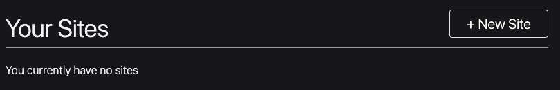

## 2. Create one site for each environment 

Create a new site for each environment in your application. Most Phoenix applications have the following environments:

1. `test`
2. `dev`
3. `prod`

For this example, three sites will be created:

1. test-blackcatprojects.xyz
2. dev-blackcatprojects.xyz
3. prod-blackcatprojects.xyz

Replace `blackcatprojects.xyz` with your project's name. 


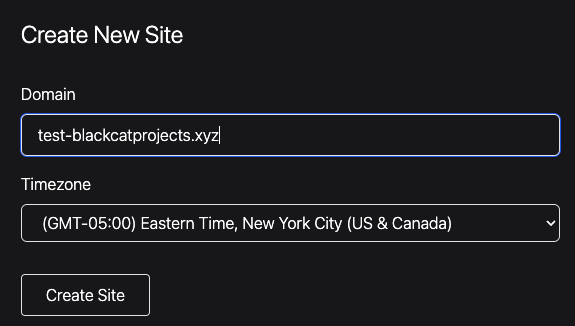

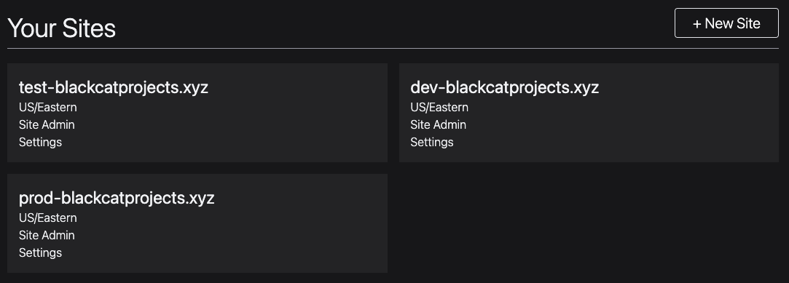

## 3. Before install, run mix test

Before installing Paraxial, it's recommended you create a new git branch, and then run `mix test` before making any code changes. Record the output of mix test, to ensure the Paraxial install does not cause tests to fail. 

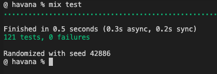

## 4. Install the agent

Add :paraxial to your mix file and run `mix deps.get`.

`{:paraxial, "~> 2.7.7"}`

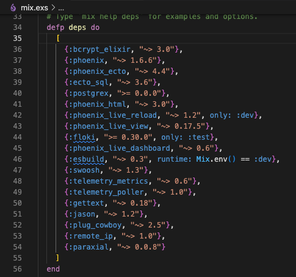

## 5. Configure dev environment 

Open `config/dev.exs` and add:

```
config :paraxial,
  paraxial_api_key: System.get_env("PARAXIAL_API_KEY"),
  fetch_cloud_ips: true
```

Set the `PARAXIAL_API_KEY` environment variable to keep this secret out of source code. 

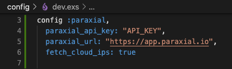

The api key's value can be found in the site settings for `dev-blackcatprojects.xyz`. The name of your site will be different. Note that the `dev-` prefix matches the config file, this is the recommended pattern. 

## 6. Update your endpoint.ex file

You will now add three lines to your `endpoint.ex` file, two plugs before your router, and one plug after the router:

```
  plug Paraxial.AllowedPlug
  plug Paraxial.RecordPlug
  plug HavanaWeb.Router
  plug Paraxial.RecordPlug
```

The reason `RecordPlug` is placed before and after the router is to collect information about requests that fail to match in the router. 

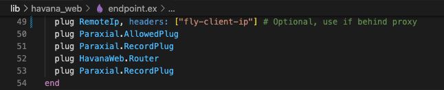

The [RemoteIP](https://github.com/ajvondrak/remote_ip) plug should only be used if you are deploying your application behind a proxy. In the example shown, `plug RemoteIp, headers: ["fly-client-ip"]` is specific to fly.io deployments. Your configuration may be different. 

## 7. Test that Paraxial works in dev

Run your application locally with `mix phx.server`, refreshing the localhost page. Your application should be running in the `dev` environment. If it is not, check your `MIX_ENV` environment variable. 

For our example, the owner of `dev-blackcatprojects.xyz` in Paraxial.io's web interface would refresh the site overview page, and see the number of allowed requests has increased. This means data is flowing, and the install was successful. 

If data is not flowing, check the following:

1. Did you put the configuration in the `dev.exs` file?
2. Is the `paraxial_cloud_ip` value correct? Does it match the site?
3. Is the `paraxial_url` set to `"https://app.paraxial.io"`, with quotes?
4. If you are storing `paraxial_api_key` as an environment variable, is it set? Can your application read it?
5. What mix environment is your application running in? Is it dev? 

Customer support is available to help, email `support@paraxial.io`. 


## 8. Configure prod environment 

Now that you have paraxial configured for your dev environment, configure it for your prod environment, using the api key from your `prod-` prefixed site. 

```
config :paraxial,
  paraxial_api_key: System.get_env("PARAXIAL_API_KEY"),
  fetch_cloud_ips: true
```

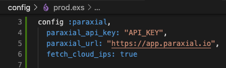

If you are deploying on a platform-as-a-service such as Gigalixir or Fly.io, ensure you have installed [remote_ip](https://github.com/ajvondrak/remote_ip) to re-write conn.remote_ip to the correct value. 

You have successfully installed Paraxial.io. To take full advantage of Paraxial, some additional configuration is required in your application code. 

## 9. (Optional) Send user login data to backend

The Paraxial agent allows you to collect information about which IP addresses are attempting to login in to which accounts in your application, and if those logins were successful. This is possible by setting two values in your conn assigns, `:paraxial_login_success` and `:paraxial_login_user_name`.

The code below was generated using the mix auth generator, however your application may require setting these values in different locations. The example below is given to illustrate how to set the assigns. 

```
conn = assign(conn, :paraxial_login_user_name, email)
conn = assign(conn, :paraxial_login_success, true)
conn = assign(conn, :paraxial_login_success, false)
```


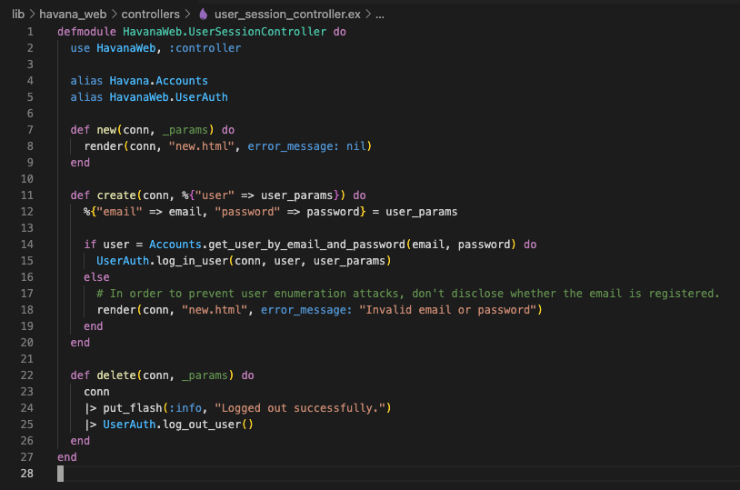


## 10. (Optional) Determine if incoming request has a cloud provider's IP Address

When the Paraxial agent starts, the `fetch_cloud_ips` configuration key determines if the agent will retrieve a data structure containing many cloud provider's public IP ranges. (AWS, GCP, Digital Ocean, etc.) The reason this is useful is that a request coming from one of these IPs is highly likely to be a bot, and not a human user. For example, you probably do not want to allow a cloud server to send login attempts to your application. 

There are two plugs that make use of this feature, `AssignCloudIP` and `BlockCloudIP`. `AssignCloudIP` will add metadata to the `conn`, but will never block an incoming request. When a conn passes through it, if `conn.remote_ip` matches a cloud provider, the conn's assigns will be updated with that info. This can be viewed in the Paraxial backend, under the site's "HTTP Traffic" page. 

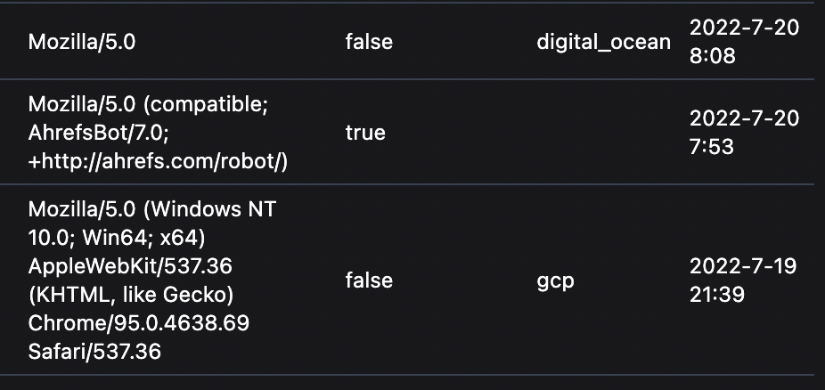 

If you want to block this traffic, use the `BlockCloudIP` plug. For the Havana example, we want to block cloud IPs from accessing routes in the `:browser` pipeline. 

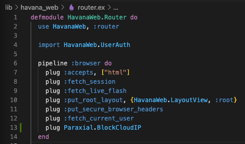

This plug can be used in your `endpoint.ex` or `router.ex` file. If your application has API endpoints that bots rely on, for example a data API intended to be used by bots, take care to only use this plug for the appropriate routes. It is discouraged to use `BlockCloudIP` in your `endpoint.ex` file, and instead use it in a router pipeline for specific routes. 

## 11. Define a rule to block credential stuffing

Now that Paraxial is working in your application, define a rule to prevent credential stuffing. 

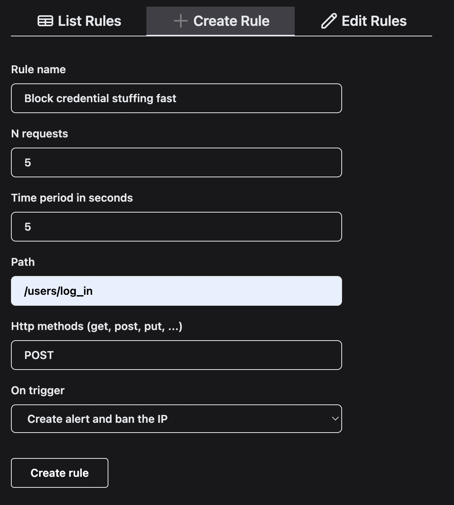

When one IP address sends > 5 POST requests to /users/log_in, in a period of 5 seconds, it will be banned and an alert will be created. 

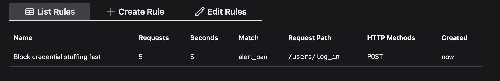
