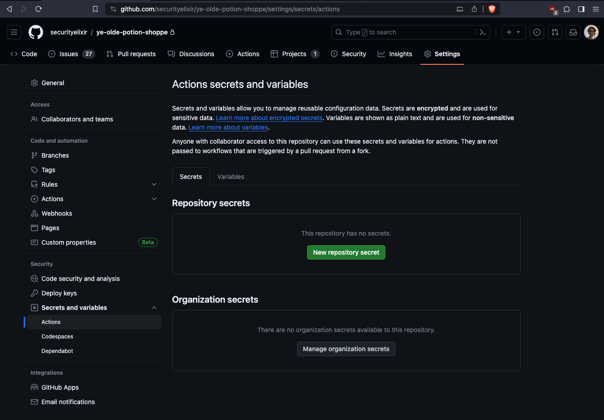
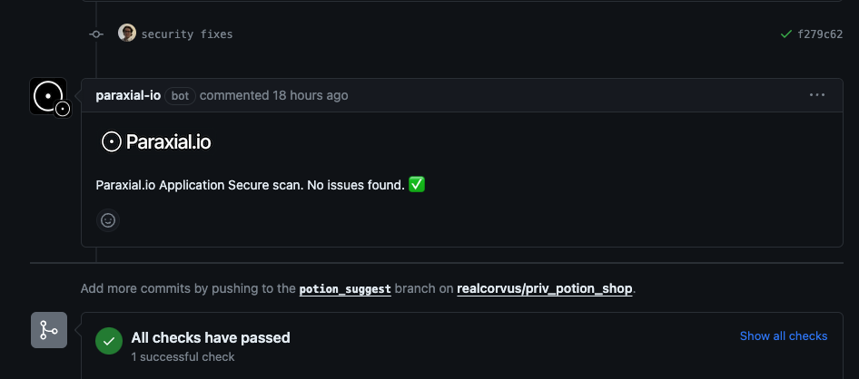

# GitHub App

This guide to installing the [Paraxial.io GitHub App](https://github.com/marketplace/paraxial-io) assumes you are using GitHub Actions for CI/CD. The app is compatible with other providers (CircleCI, etc). 

For an overview of why the GitHub App is useful, see the blog post [Introducing the Paraxial.io GitHub App](https://paraxial.io/blog/github-app)

## 1. Create a Paraxial.io site, install the agent 


Why install the Paraxial.io agent locally if the goal is to run the Github app in CI/CD? This is for developer experience and happiness. A CI run can take minutes to complete, and the cycle of "make a code change, wait several minutes for CI to finish" slows down developer productivity. By running the check locally, the debugging loop is much faster. 

Note: You MUST use version `2.6.3` or later. Earlier versions do not support the GitHub App.

`mix.exs`
```
{:paraxial, "~> 2.8.3"}
```
```
mix deps.get
```

Install the Paraxial.io agent in `mix.exs`, then configure `dev.exs` and `prod.exs`.

```
config/dev.exs

config :paraxial,
  paraxial_api_key: System.get_env("PARAXIAL_API_KEY")
```

```
config/prod.exs

config :paraxial,
  paraxial_api_key: System.get_env("PARAXIAL_API_KEY")
```

For the GitHub app we really only need `dev.exs`, however the reason you want this in both environments is for the additional runtime protection features of Paraxial.io. 

Set the environment variable in your terminal with:

`$ export PARAXIAL_API_KEY=df90...redacted...`

This key is found in the "Site Settings" page. Now run:

```
% mix deps.compile
% mix paraxial.scan
13:35:00.130 [info]  [Paraxial] API key found, scan results will be uploaded
...
13:35:01.905 [info]  [Paraxial] Scan written successfully. UUID 4b6a5fe3-626a-46e5-a959-6008f6114a74
```

This confirms Paraxial.io is installed and working locally. 


## 2. Install the Paraxial.io GitHub App, get the install_id. 

The Paraxial.io App can be installed in an organization or individual account. GitHub Marketplace - https://github.com/marketplace/paraxial-io


Note the install_id of `45554672`. Your value will be different. Make a note of this value somewhere, you will need it later.

The Paraxial.io Github App is compatible with all CI/CD pipelines. We will be using a Github Action in this example. The following is required:

1. Paraxial.io App Install ID (`45554672` in this example, your value will be different)
2. Repo Owner
3. Repo Name
4. Pull Request number

The dynamic values should be accessible in your CI environment. 

## 3. Put the Paraxial.io API key in GitHub Actions Secrets 

This secret key is found in "Site Settings" in the Paraxial.io web interface. 




## 4. Configure the GitHub Action

Before continuing, answer the following questions:

<br>

Q: What is the name of your repo's primary branch? (It is probably `master` or `main`) 

If your repo's branch is different, replace the "branches" value.

Q: If Paraxial.io detects security problems, do you want the build to fail? 

If you do not want the build to fail when security issues are detected, remove the `--add-exit-code` flag. 

Q: What is your Paraxial.io Github App Install ID? 

See the section above 

<br>

GitHub Action:

`.github/workflows/elixir.yml`

```yaml
name: Paraxial.io Application Secure

on:
  push:
    branches: [ "master" ]
  pull_request:
    branches: [ "master" ]

permissions:
  contents: read

jobs:
  build:

    name: Build and test
    runs-on: ubuntu-latest

    env:
      PARAXIAL_API_KEY: ${{ secrets.PARAXIAL_API_KEY }}

    steps:
    - uses: actions/checkout@v3
    - name: Set up Elixir
      uses: erlef/setup-beam@61e01a43a562a89bfc54c7f9a378ff67b03e4a21 # v1.16.0
      with:
        elixir-version: '1.15.2' # [Required] Define the Elixir version
        otp-version: '26.0'      # [Required] Define the Erlang/OTP version
    - name: Restore dependencies cache
      uses: actions/cache@v3
      with:
        path: deps
        key: ${{ runner.os }}-mix-${{ hashFiles('**/mix.lock') }}
        restore-keys: ${{ runner.os }}-mix-

    - name: Install dependencies
      run: mix deps.get

    - name: Compile dependencies
      run: mix deps.compile

    - name: Get Github Repo Name
      run: echo "REPO_NAME=$(echo ${{ github.repository }} | cut -d'/' -f2)" >> $GITHUB_ENV

    - name: Paraxial.io Scan, pull request does not exists
      if: "${{ github.event.number == '' }}"
      run: |
        mix paraxial.scan --sobelow-config --add-exit-code

    - name: Paraxial.io Scan, pull request exists 
      if: "${{ github.event.number != '' }}"
      run: |
        mix paraxial.scan --github_app \
          --install_id REPLACE_THIS_VALUE \
          --repo_owner ${{ github.repository_owner }} \
          --repo_name ${{ env.REPO_NAME }} \
          --pr_number ${{ github.event.number }} \
          --sobelow-config \
          --add-exit-code
```

Example of a successful run:

```yaml
  mix paraxial.scan --github_app \
    --install_id 45233668 \
    --repo_owner realcorvus \
    --repo_name priv_potion_shop \
    --pr_number 25 \
    --add-exit-code
  shell: /usr/bin/bash -e {0}
  env:
    PARAXIAL_API_KEY: ***
    INSTALL_DIR_FOR_OTP: /opt/hostedtoolcache/otp/ubuntu-22.04/OTP-26.0.2/x64
    INSTALL_DIR_FOR_ELIXIR: /opt/hostedtoolcache/elixir/1.15.2-otp-26/x64
    REPO_NAME: priv_potion_shop

18:20:28.518 [info] [Paraxial] API key found, scan results will be uploaded
[Paraxial] Scan findings: %Paraxial.Scan{
  timestamp: ~U[2024-01-01 18:20:30.840501Z],
  findings: [
    %Paraxial.Finding{
      source: "sobelow",
      content: %{
        "confidence" => "high_confidence",
        "file" => "lib/carafe_web/controllers/potion_controller.ex",
        "line" => 29,
        "type" => "Misc.BinToTerm: Unsafe `binary_to_term`",
        "variable" => "cursor_bin"
      }
  ...
  api_key: "REDACTED"
}
[Paraxial] Github Upload info: %{
  "api_key" => "REDACTED",
  "installation_id" => "45233668",
  "pull_request_number" => "25",
  "repository_name" => "priv_potion_shop",
  "repository_owner" => "realcorvus",
  "scan_uuid" => "e381fb5b-af18-4abc-b782-3c7acda6368d"
}

18:20:31.205 [info] [Paraxial] Scan written successfully. UUID e381fb5b-af18-4abc-b782-3c7acda6368d

18:20:31.205 [info] [Paraxial] Github App Correct Arguments

18:20:33.148 [info] [Paraxial] Github PR Comment Created successfully

18:20:33.148 [info] [Paraxial] URL: (Pull request url here)
Error: Process completed with exit code 1.
```

Troubleshooting:

1. What version of the Paraxial.io agent is running in CI/CD? Check your lock file. You must use version `2.6.3` or later for the GitHub App to work.

## 5. Open a Pull Request

You should have completed the following by now:

1. Installed the Paraxial.io GitHub App

2. Configured `mix paraxial.scan --github_app` to run in CI/CD

3. Put the correct Paraxial.io Site API Key into the CI/CD pipeline

To use the Paraxial.io app, open a pull request:


If no issues are found, you will get a green check comment:


