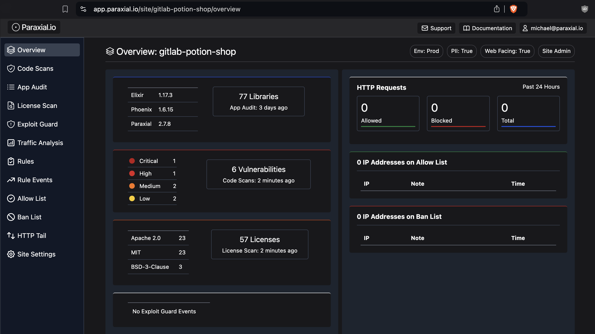
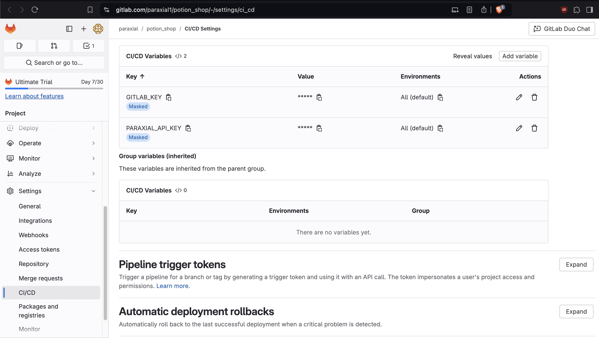

# GitLab App

## 1. Prerequisites 

Before starting with the GitLab App, ensure that Paraxial.io is running in your project. For example, you should be able to run:

`% mix paraxial.scan`

And view the results of this scan in the web interface. If you have not completed this setup, go the [getting started guide](./start.md) and complete that first before continuing. 

If you can see recent events for "Vulnerabilities" in your site's overview page, then continue with setup:



## 2. GitLab API token 


You will need to create a GitLab access token. This may be:

- A personal access token
- A project access token
- A group access token

The access token you create must have the `api, write_repository` scopes. It should have the format: `glpat-Yhg[redacted]`

For the current project, go to:

Settings > CI/CD > Variables

And set the following:

- PARAXIAL_API_KEY (found in app.paraxial.io, under your site's settings)
- GITLAB_KEY (the one you just created with `api, write_repository` scopes)



## 3. GitLab CI/CD

Create the following in your project root directory:

`.gitlab-ci.yml`

```

workflow:
  rules:
    - if: $CI_MERGE_REQUEST_IID

image: elixir:latest

services:
  - postgres:latest
variables:
  POSTGRES_DB: carafe
  POSTGRES_HOST: postgres
  POSTGRES_USER: postgres
  POSTGRES_PASSWORD: "postgres"
  MIX_ENV: "test"

before_script:
  - mix local.rebar --force
  - mix local.hex --force
  - mix deps.get

mix:
  script:
    - mix test
    - mix paraxial.scan --gitlab_app --gitlab_token $GITLAB_KEY --gitlab_project $CI_PROJECT_ID --merge_request $CI_MERGE_REQUEST_IID  --sobelow-config --add-exit-code

deploy:
  stage: deploy
  script: echo "Define your deployment script!"
  environment: production
```

Note the arguments:

- `--gitlab_app`     - required to send scan results to GitLab
- `--gitlab_token`   - the personal, project, or group access token
- `--gitlab_project` - the GitLab project ID
- `--merge_request`  - merge request IID 

The following optional arguments are included:

- `--sobelow-config` - read the .sobelow-conf file in the project
- `--add-exit-code`  - return non-zero exit code if findings exist, to fail CI/CD 

If you are using the self hosted version of GitLab, add the flag:

`--gitlab_url https://gitlab.example.com`

For example:

`mix paraxial.scan --sobelow-config --gitlab_app --gitlab_token $GITLAB_KEY --gitlab_project $CI_PROJECT_ID --merge_request $CI_MERGE_REQUEST_IID --gitlab_url https://gitlab.paraxial.io --add-exit-code`

If you are using the cloud version of GitLab, this flag is not needed. 


If no issues are found, you will get a green check comment:


