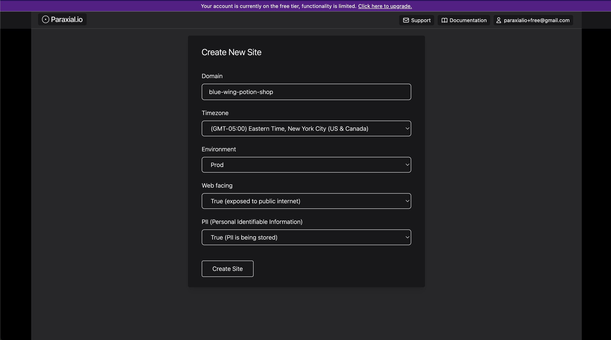
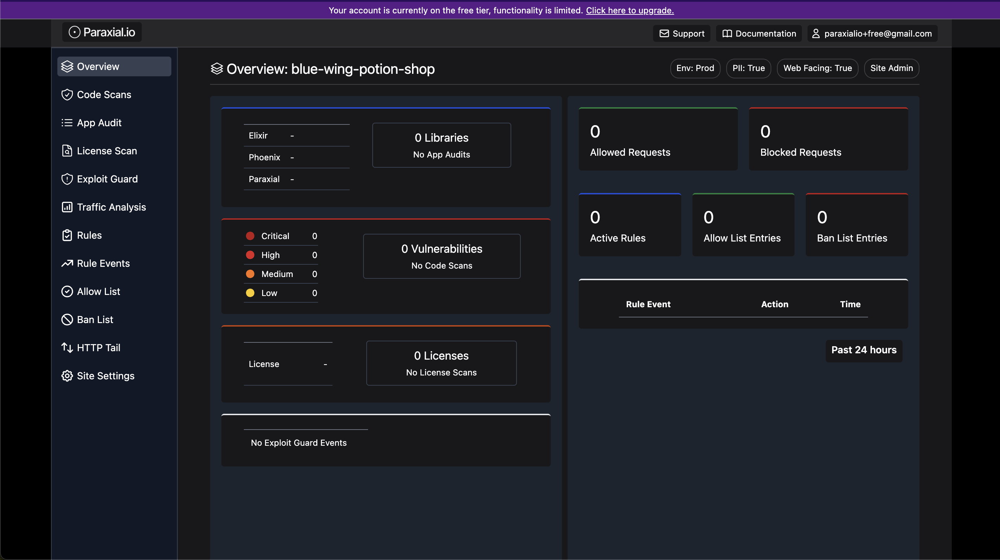
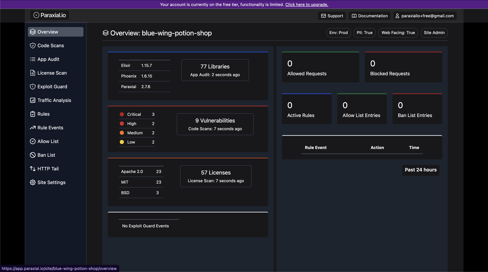

# Getting started with Paraxial.io (Elixir, Free Tier)

This tutorial is a step-by-step guide to setup Paraxial.io with the open source vulnerable Elixir application [Potion Shop.](https://github.com/securityelixir/potion_shop) It will walk through creating an account, installing the agent, and getting results flowing to the backend. Functionality is limited in the free tier, for example you cannot send HTTP traffic to the Paraxial.io backend for analysis.

## Free Tier Limits

<ol class="list-decimal pl-10 space-y-2">
<li>Maximum of 1 Site.</li>
<li>You cannot invite users to a Site.</li>
<li>No bot defense related features.</li>
<li>Limit of 5 scans per site, per month.</li>
<li>No automated network scanning (daily, weekly)</li>
</ol>

If you have questions about Paraxial, need enterprise support, or would like to upgrade your plan, email `support@paraxial.io`.

## 1. Create your Paraxial.io account 

Go to [https://app.paraxial.io/](https://app.paraxial.io/) in your web browser. Create a new account. You will receive a confirmation email, use it to confirm your account and sign in. You have no sites at this point. 

## 2. Create your site

Create a new site, but pick a different domain besides `local_potion_shop`. Note that the `domain` is really treated as a comment by Paraxial.io, you can put any value you want here, it does not have to be a valid URL and no HTTP requests are ever sent to it.





## 3. Install the agent

This guide assumes you are installing Paraxial.io in the open source vulnerable Elixir app [Potion Shop.](https://github.com/securityelixir/potion_shop)

```
% git clone https://github.com/securityelixir/potion_shop.git
Cloning into 'potion_shop'...
...

% cd potion_shop
```

Open `mix.exs`. If you see the line:

```elixir
  {:sobelow, "~> 0.13", only: [:dev, :test], runtime: false}
```

Delete it. The Paraxial agent will install Sobelow as a dependency, deleting this line avoids a conflict. 

Add the following to your `mix.exs` file:

```elixir
{:paraxial, "~> 2.8.2"}
```

Then run: 

```
mix deps.get

mix ecto.setup 

mix phx.server
```

Check to make sure the running application matches the screenshot in the Potion Shop README before you continue. - https://github.com/securityelixir/potion_shop

## 4. Configure the dev environment 

Open `config/dev.exs` and add:

```
config :paraxial,
  paraxial_api_key: System.get_env("PARAXIAL_API_KEY")
```

Set the `PARAXIAL_API_KEY` environment variable to keep this secret out of source code. 

The API key's value is found under "Site Settings", it looks like a UUID. To keep it out of source code for this tutorial, you can do:

`export PARAXIAL_API_KEY=your_value_here`

## 5. Install the Paraxial agent

Run: 

`mix deps.get` - Install the agent

`mix paraxial.scan` - Runs Code Scans and License Scan

`mix phx.server` - Runs app audit. If you are not in a Phoenix application, you can also do `iex -S mix`

When running these commands watch out for errors and warnings. Common issues:

1. Did you put the configuration in the `config/dev.exs` file?
2. Is `PARAXIAL_API_KEY` set correctly? Sometimes there is a trailing newline and that breaks things.
3. Is `paraxial_url` set to `"https://app.paraxial.io"`, with quotes?
4. What mix environment is your application running in? Is it dev? 
5. If the API key is being read, but the scan upload fails, is it the correct value?

Customer support is available to help, email `support@paraxial.io`. 

If everything worked you should see the following screen:



