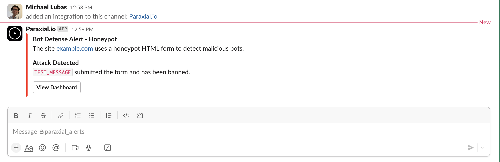

# Getting started with Paraxial.io

This tutorial is a step-by-step guide to setup Paraxial.io with the open source vulnerable Elixir application [Potion Shop.](https://github.com/securityelixir/potion_shop) It will walk through creating an account, installing the agent, and getting results flowing to the backend. Functionality is limited in the free tier, for example you cannot send HTTP traffic to the Paraxial.io backend for analysis.

## Free Tier Limits

1. Maximum of 2 Sites.
2. You cannot invite users to a Site.
3. HTTP traffic cannot be ingested by the backend.
4. Limit of 30 scans per site, per month. 

If you have questions about Paraxial, need enterprise support, or would like to upgrade your plan, email `support@paraxial.io`.

## 1. Create your Paraxial.io account 

Go to [https://app.paraxial.io/](https://app.paraxial.io/) in your web browser. Create a new account. You will receive a confirmation email, use it to confirm your account and sign in. You have no sites at this point. 

## 2. Create your site

Create a new site, but pick a different domain besides `local_potion_shop`. Note that the `domain` is really treated as a comment by Paraxial.io, you can put any value you want here, it does not have to be a valid URL and no HTTP requests are ever sent to it.


## 3. Install the agent

This guide assumes you are installing Paraxial.io in the open source vulnerable Elixir app [Potion Shop.](https://github.com/securityelixir/potion_shop)

```
% git clone https://github.com/securityelixir/potion_shop.git
Cloning into 'potion_shop'...
...

% cd potion_shop
```

Open `mix.exs`. If you see the line:

```elixir
  {:sobelow, "~> 0.13", only: [:dev, :test], runtime: false}
```

Delete it. The Paraxial agent will install Sobelow as a dependency, deleting this line avoids a conflict. 

Add the following to your `mix.exs` file:

```elixir
{:paraxial, "~> 2.7.7"}
```

Then run: 

```
mix deps.get

mix ecto.setup 

mix phx.server
```

Check to make sure the running application matches the screenshot in the Potion Shop README before you continue. - https://github.com/securityelixir/potion_shop

## 4. Configure the dev environment 

Open `config/dev.exs` and add:

```
config :paraxial,
  paraxial_api_key: System.get_env("PARAXIAL_API_KEY")
```

Set the `PARAXIAL_API_KEY` environment variable to keep this secret out of source code. 

The API key's value is found under "Site Settings", it looks like a UUID. To keep it out of source code for this tutorial, you can do:

`export PARAXIAL_API_KEY=your_value_here`

## 5. Install the Paraxial agent

Run: 

`mix deps.get` - Install the agent

`mix paraxial.scan` - Runs Code Scans and License Scan

`mix phx.server` - Runs app audit. If you are not in a Phoenix application, you can also do `iex -S mix`

When running these commands watch out for errors and warnings. Common issues:

1. Did you put the configuration in the `config/dev.exs` file?
2. Is `PARAXIAL_API_KEY` set correctly? Sometimes there is a trailing newline and that breaks things.
3. Is `paraxial_url` set to `"https://app.paraxial.io"`, with quotes?
4. What mix environment is your application running in? Is it dev? 
5. If the API key is being read, but the scan upload fails, is it the correct value?

Customer support is available to help, email `support@paraxial.io`. 

If everything worked you should see the following screen:


On the free tier, you are limited to 30 code scans per month. 

## 6. Setup Slack App

The Slack App is included with the free tier, and alerts on the following:

1. IP Bans to a rule match. For example, "An IP sends > 5 requests in 10 seconds to `/users/login`". 

2. IP Ban due to a honeypot form being submitted. 

3. Exploit Guard triggered (monitor or block mode). 

You will see examples of these soon. To setup the Slack app go to your account settings:


Add to Slack:


Send a test message:



## 7. Bot Defense, Rate Limiting

The free Paraxial.io plan does not support sending HTTP requests to the backend for Bot Defense, so the setup is slightly different compared to a paid account. 

Open the `endpoint.ex` file in your project and add the following:

```elixir
  plug RemoteIp, headers: ["fly-client-ip"]  # Required if behind a proxy, "fly-client-ip" is Fly.io specific, your setting may be different https://github.com/ajvondrak/remote_ip
  plug Paraxial.AllowedPlug                  # Determines if an HTTP request should be allowed or blocked before it reaches the router
  plug HavanaWeb.Router
```

Note that when an IP address is banned, the incoming request will be dropped before it reaches the router to reduce server load. 

Now we want to ban any IP that does more than 5 login attempts in 20 seconds. Lets use [Potion Shop](https://github.com/securityelixir/potion_shop) as the example. 

`lib/carafe_web/controllers/user_session_controller.ex`

```elixir
defmodule CarafeWeb.UserSessionController do
  ...

  def create(conn, %{"user" => user_params}) do
    %{"email" => email, "password" => password} = user_params

    if user = Accounts.get_user_by_email_and_password(email, password) do
      UserAuth.log_in_user(conn, user, user_params)
    else
      # In order to prevent user enumeration attacks, don't disclose whether the email is registered.
      render(conn, "new.html", error_message: "Invalid email or password")
    end
  end
  ...

end
```

After install:

```elixir
  def create(conn, %{"user" => user_params}) do
    ip_string = conn.remote_ip |> :inet.ntoa() |> to_string()
    ip = conn.remote_ip
    key = "user-login-#{ip_string}"
    seconds = 20
    count = 5
    ban_length = "hour"
    msg = "`> 5 requests in 20 seconds to login from #{ip_string}`"
    case Paraxial.check_rate(key, seconds, count, ban_length, ip, msg) do
      {:allow, _count} ->
        do_create(conn, user_params)

      {:deny, _count} ->
        conn
        |> put_resp_content_type("text/html")
        |> send_resp(429, "Rate limited")
    end
  end

  def do_create(conn, user_params) do
    %{"email" => email, "password" => password} = user_params

    if user = Accounts.get_user_by_email_and_password(email, password) do
      UserAuth.log_in_user(conn, user, user_params)
    else
      # In order to prevent user enumeration attacks, don't disclose whether the email is registered.
      render(conn, "new.html", error_message: "Invalid email or password")
    end
  end
```

Slack notification: 


## Further Reading

The following features are also included in the free tier:

[GitHub App - security reviews on each new pull request](./elixir_github_app.md)

[Exploit Guard - block hacking attempts at runtime](./user_manual.md#12-exploit-guard)

[Honeypot URLs - ban malicious IPs](./user_manual.md#11-honeypot-urls)

[Cloud IPs - a plug to stop bot traffic, useful on authentication routes](./cloud_ips.md)

