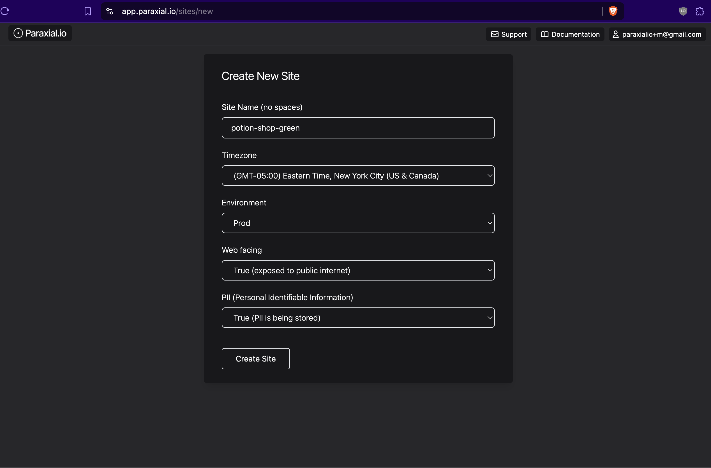

# Getting Started with Paraxial.io for Elixir

This guide will walk you through setup for Paraxial.io. Most features require a paid account. If you are on the free tier, email `support@paraxial.io` to request a 2 week free trial. 

## Install Roadmap

### Application Secure
- Asset management - A full inventory of all your Elixir projects
- Network Scans - Determine which ports are open on your web server
- Code Scans - Source code (SAST) and dependency (SCA) scanning 
- GitHub or GitLab App - Get security feedback in your pull request
- License Scans - Determine which open source licenses are in use
- App Audit - A runtime inventory of all your dependency versions
- Exploit Guard - runtime detection of deserialization exploits

### Bot Defense
- Ingesting HTTP traffic
- Rate limiting - Ban IPs that do too many login attempts
- Honeypots - Ban IPs that submit a fake form
- Blocking data center/cloud IP attacks
- Banning bots scanning for `.php` routes


## Sign Up, Create Your First Site

Create your account here - [https://app.paraxial.io/users/register](https://app.paraxial.io/users/register)

Confirm your email and create your first site:



`Site Name` - Cannot contain spaces.

`Timezone` - Select the timezone where you are located

`Environment` - Where is this application deployed? You should create one site for each environment.

`Web facing` - Does this application face the public internet? This is a label set by the account owner, not detected by the agent. 

`PII (Personal Identifiable Information)` - Does this application handle sensitive user data? This is a label set by the account owner, Paraxial.io cannot access PII. 


## Asset Management

Now that your site is created you can get a better sense of how Asset Management Works:


This view displayed:

- Each site you have created
- The environment, PII, and Web Facing values
- The current vulnerabilities (via code scans)
- When the last code scan took place

The foundation of a security program is understanding what assets needs to be protected. With this view, you can quickly get a sense of what security controls are currently active across your organization. 


## Network Scans

Before starting with network scans, determine if your application is hosted on a server where you control which ports are exposed to the public internet, or a Platform as a Service (PaaS).

PaaS: Heroku, Gigalixir, Render, Fly.io, Railway

VPS: AWS, GCP, Hetzner, Azure, Digital Ocean 

If your hosting provider is in the "PaaS" group, network scanning is not applicable to your application, because you don't have access to the host operating system and network configuration. If you are on a VPS, then using network scanning is recommended. See the [documentation page for Network Scans to start.](./../network_scans.md)


## Code Scans

There are three popular security tools for ensuring the security of Phoenix applications:

1. `Sobelow`, for static analysis of source code for vulnerabilities, https://github.com/nccgroup/sobelow 
2. `deps.audit`, to scan a project's dependencies for vulnerabilities, https://github.com/mirego/mix_audit
3. `hex.audit`, to scan for dependencies that have been marked as retired, https://hexdocs.pm/hex/Mix.Tasks.Hex.Audit.html 

It may seem straightforward to integrate these tools into your existing CI/CD pipeline, but consider the following questions:

1. When was the last time the scan ran successfully? 
2. Do you have a record of when all these scans happened?
3. Did the numbers of vulnerabilities increase or decrease compared to the previous scans? 
4. How do you view the findings of the most recent scan? Of a scan from 3 months ago? 

With the Paraxial.io agent, you now have access to the command: 

```
mix paraxial.scan
```

This will run `Sobelow`, `deps.audit`, and `hex.audit` on your application, then upload the results to the Paraxial.io backend, so you have a detailed record for compliance audits (SOC 2, HIPAA, ISO). 


### Install the Paraxial.io Agent in Your Project

Now it is time to install the Paraxial.io agent. The agent is written in Elixir, and installed as a Hex dependency - [https://hex.pm/packages/paraxial](https://hex.pm/packages/paraxial)

`mix.exs`
```
{:paraxial, "~> 2.8.2"}
```

```
mix deps.get
```

The package is installed as a normal Elixir dependency. Once you confirm the install was successful, go to your site in the web interface of [app.paraxial.io](https://app.paraxial.io/sites) -> Site Settings -> Site API Key. 

With the private API key, configure your project:

`config/dev.exs`
```
config :paraxial,
  paraxial_api_key: System.get_env("PARAXIAL_API_KEY")
```

Then in your terminal:

```
% export PARAXIAL_API_KEY=your_secret_here
% mix deps.compile
% mix paraxial.scan
11:49:15.586 [info] [Paraxial] v2.8.2, scan starting

11:49:15.587 [info] [Paraxial] API key found, scan results will be uploaded
...
11:49:17.619 [info] [Paraxial] Scan written successfully. UUID bbef9230-8d31-4bba-8148-91358a3207f9
```

For information about how to use a Sobelow configuration file, ignore findings, and an FAQ, see the Code Scans documentation. 


## GitHub or GitLab App

Developers in your organization can run `mix paraxial.scan` locally to ensure their code does not have any security problems before opening a pull request. This is beneficial is CI/CD takes several minutes to run, while the mix command takes only a few seconds. 

A good practice is to scan each new pull request in your organization for security issues. Paraxial.io has a GitHub and GitLab app which does the following:

1. Create a comment on each new pull request highlighting any security issues
2. Ranks the issues by severity (remote code execution and SQL injection are critical, for example)
3. Provides developers with detailed instructions on how to verify and fix the problem 

The GitHub/GitLab App runs in CI, so these security checks will be part of your team's everyday workflow. For information about getting setup, see the GitHub and GitLab app documentation. 


## License Scans and App Audit 

When you ran `mix paraxial.scan`, which is a compile time operation, an inventory of all your dependencies, the version of each, and their open source license is sent to the Paraxial.io backend. 

The App Audit feature is similar, in that it also generates a list of all the dependencies, the difference is:

`License Scan` - Compile time, dependency versions, with license information

`App Audit` - Runtime, dependency versions 

Why this redundancy? Sometimes the dependencies specified in `mix.lock` do not match what is actually deployed in production. In a scenario where there is a major vulnerability in a core library such as plug, cowboy, or phoenix, it is a good idea to use App Audit.

To get App Audit data for your current site, start your application with a valid Paraxial API key:

```
@ potion_shop % mix phx.server   
[info] [Paraxial] v2.8.2 URL and API key found. Agent will be started
...
[info] Running CarafeWeb.Endpoint with cowboy 2.13.0 at 127.0.0.1:4000 (http)
[info] Access CarafeWeb.Endpoint at http://localhost:4000
...
[info] [Paraxial] App Audit upload success
```


## Exploit Guard


Exploit Guard provides runtime application self protection for your application. To use Exploit Guard, ensure your agent version is >= `2.4.0`.

Exploit Guard has two configurations, `:monitor` or `:block`

`monitor` - No action will be taken, this is the "read only" option.

`block` - The process where the new function was created will be killed.

When Exploit Guard detects a new function is created at runtime, an alert will be sent to your Paraxial.io site. If you have a webhook configured, a POST request will be sent. 

Example:

```
config :paraxial,
  paraxial_api_key: System.get_env("PARAXIAL_API_KEY"),
  exploit_guard: :monitor  # This value can be :monitor or :block
```

To trigger an Exploit Guard event for testing, start your application with:

```
@ potion_shop % iex -S mix       
...
[info] [Paraxial] Exploit Guard set to monitor mode
[info] [Paraxial] App Audit upload success
iex(2)>  a = :erlang.term_to_binary(fn x -> x end)
<<131, 112, 0, 0, 0, 161, 1, 201, 188, 156, 143, 16, 126, 173, 32, 90, 79, 205,
  206, 160, 193, 177, 248, 0, 0, 0, 42, 0, 0, 0, 1, 119, 8, 101, 114, 108, 95,
  101, 118, 97, 108, 97, 42, 98, 6, 77, 228, 228, 88, 119, ...>>
iex(3)> :erlang.binary_to_term(a)      
#Function<42.105768164/1 in :erl_eval.expr/6>
[alert] [Paraxial] Exploit behavior detected, binary_to_term created function
[alert] [Paraxial] Exploit info: 
13:15:19.168277 <0.478.0> erlang:binary_to_term(<<131,112,0,0,0,161,1,201, ...
[alert] [Paraxial] Monitor mode active, no action taken
[alert] [Paraxial] Exploit behavior detected, binary_to_term created function
[alert] [Paraxial] Exploit info: 
13:15:19.177085 <0.478.0> erlang:binary_to_term/1 --> #Fun<erl_eval.42.105768164>
[alert] [Paraxial] Monitor mode active, no action taken
```

Visit `Site > Exploit Guard` to view the event. 

The implementation of Exploit Guard is open source, see [Exploit Guard: Open Source Runtime Application Self Protection for Elixir.](https://paraxial.io/blog/exploit-guard)

For more information on how RCE exploits work in Elixir, see the article [Elixir/Phoenix Security: Remote Code Execution and Serialisation.](https://paraxial.io/blog/elixir-rce)


## Application Secure End

This concludes the high level overview of Paraxial.io Application Secure. All the features specified above are included in your Application Secure Plan. For more specific guidance, consult the relevant documentation page:

Code Scans (`mix paraxial.scan`)

- Full list of all the flags
- How to ignore findings
- How to setup with an Umbrella application

<br>

GitHub and GitLab App

- Full setup instructions
- Example CI/CD template for GitHub Actions


## Bot Defense

To get started with bot defense, see the article Getting Started - Bot Defense.