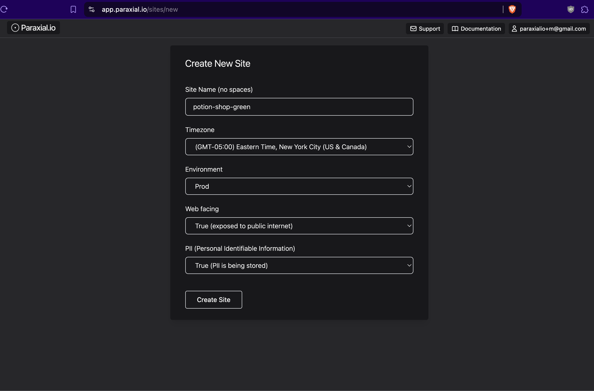
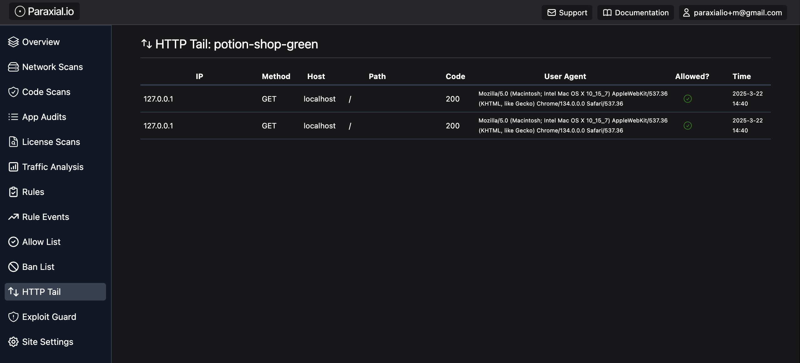
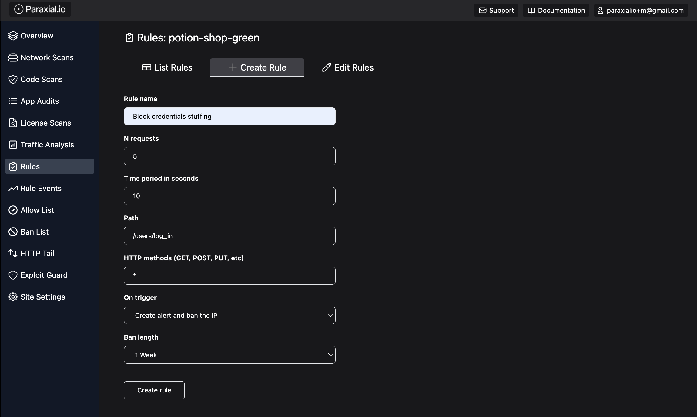
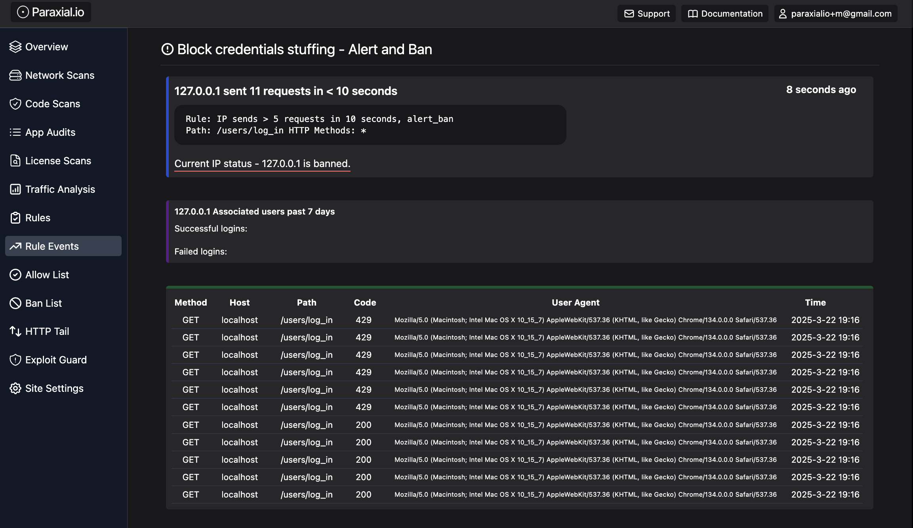

# Getting Started with Paraxial.io for Elixir - Bot Defense

This guide is for Paraxial.io Bot Defense. A paid account is required. If you are on the free tier, email `support@paraxial.io` to request a 2 week free trial.

You will setup the following:

- Ingesting HTTP traffic
- Rate limiting - Ban IPs that do too many login attempts
- Honeypots - Ban IPs that submit a fake form
- Banning bots scanning for `.php` routes
- Blocking data center/cloud IP attacks


## Create Account and Install Paraxial.io
You can skip this section if you have already installed Paraxial.io by following the [Getting Started guide for Application Secure.](./started_bot.md)

Create your account here - [https://app.paraxial.io/users/register](https://app.paraxial.io/users/register)

Confirm your email and create your first site:



`Site Name` - Cannot contain spaces.

`Timezone` - Select the timezone where you are located

`Environment` - Where is this application deployed? You should create one site for each environment.

`Web facing` - Does this application face the public internet? This is a label set by the account owner, not detected by the agent. 

`PII (Personal Identifiable Information)` - Does this application handle sensitive user data? This is a label set by the account owner, Paraxial.io cannot access PII. 

---

Install the Paraxial.io agent. The agent is written in Elixir, and installed as a Hex dependency - [https://hex.pm/packages/paraxial](https://hex.pm/packages/paraxial)

`mix.exs`
```
{:paraxial, "~> 2.8.3"}
```

```
mix deps.get
```

The package is installed as a normal Elixir dependency. Once you confirm the install was successful, go to your site in the web interface of [app.paraxial.io](https://app.paraxial.io/sites) -> Site Settings -> Site API Key. 

With the private API key, configure your project:

`config/dev.exs`
```
config :paraxial,
  paraxial_api_key: System.get_env("PARAXIAL_API_KEY")
```


## Ingest HTTP Traffic

Create a new Git branch, then run `mix test` before making any code changes. If any tests are failing, make a note of that fact before you continue with the install. 

Run:

```
mix paraxial.scan
```

To ensure you have the dependency installed and API configured correctly. If the scan runs and uploads successfully, continue. 

Now that you are on a new branch, and have confirmed that your install is working, add the following plugs to record HTTP traffic:

`endpoint.ex`
```
  # plug RemoteIp                  # This plug is optional, only needed if you are behind a proxy
  plug Paraxial.AllowedPlug        # Determine if an incoming request is allowed based on ban list
  plug Paraxial.RecordPlug         # To record requests that do not match the router
  plug YourProjectNameWeb.Router   # Change to your own project name
  plug Paraxial.RecordPlug         # To record requests that did match the router
```

Note that `plug Paraxial.RecordPlug` appearing twice is intentional.

Paraxial.io uses the value of `conn.remote_ip` for bot defense. If you are behind a proxy, every HTTP request will have the same IP. This can be fixed via the [RemoteIP](https://github.com/ajvondrak/remote_ip) plug. For example, `plug RemoteIp, headers: ["fly-client-ip"]` is specific to fly.io deployments. Your configuration may be different. 

Now start your application, make sure the configuration is correct, and send some local HTTP requests:

```
@ potion_shop % mix phx.server
Generated carafe app
[info] [Paraxial] v2.8.3 URL and API key found. Agent will be started  <-- This is what you want to see
[info] Access CarafeWeb.Endpoint at http://localhost:4000
[info] GET /
[info] Sent 200 in 58ms
[info] GET /
[info] Sent 200 in 3ms
```

The requests will show as from localhost:



If your application has a large amount of HTTP traffic (> 100,000 HTTP requests/month), you can restrict sending traffic to only specific routes. For detailed instructions see the [Bot Defense documentation page.](./bot_defense.md#exclude-data-collection-for-specific-routes)

## Rate Limiting with Rules

Now that you have the appropriate plug in place (`plug Paraxial.AllowedPlug`), define the following bot defense rule:

If an IP sends more than 5 login attempts in 10 seconds, ban for 1 week:



You can use a similar route in your own application during testing. Now send a few HTTP requests by refreshing the page and observe a rule event has been created:



By default, the Paraxial.io agent does not send user emails to the backend. You can get the history of login attempts for an IP address, instructions in [the Bot Defense docs.](./bot_defense.md#using-the-paraxial-assigns)


## HTML Honeypot

Find a controller that does not require auth, create the following action:

```
# Values for second argument (length) are :hour, :day, :week, :infinity

def honeypot_ban(conn, _params) do
  Paraxial.ban_ip(conn.remote_ip, :week, "Triggered honeypot form, ban for 1 week")
  json(conn, %{ok: "system online"})
end
```

In your router, find a scope that goes through the :browser pipeline (for CSRF protection) and does not require auth, for example:

```
  scope "/", ParaxWeb do
    pipe_through :browser

    post "/customer", PageController, :honeypot_ban
  end
```

Create the form, with CSRF protection:

```
<%= form_for @conn, Routes.page_path(@conn, :honeypot_ban), [style: "display:none !important"], fn f -> %>
  <%= text_input f, :email, tabindex: -1 %>
  <%= text_input f, :password, tabindex: -1 %>
  <%= submit "Register" %>
<% end %>
```

LiveView version:

```
def render(assigns) do
  ~H"""
  <.form for={@form} id="customer_form" action={~p"/customer"} style="display:none !important">
    <.input field={@form[:email]} type="email" label="Email" tabindex="-1" />
    <.input field={@form[:password]} type="password" label="Password" tabindex="-1" />
    <button>Register</button>
  </.form>
  ...
```

```
# @form needs a value
def mount(_params, _session, socket) do
  form = to_form(%{}, as: "user")
  {:ok, assign(socket, form: form)}
end
```

Note that you have have to change the values here, for example your application may not have a `PageController`, you will have to substitute with a public controller action.

To test your implementation, use inspect element in your browser to remove `display:none !important` on the rendered page, then submit the form. If you get banned, the setup was successful. 


## Banning Malicious Clients Doing .php Requests

In a Phoenix app you may want to define a plug with some custom logic, for example if an IP sends a request ending in `.php`, this is a strong signal they are not a real user and should be banned. You could write this plug yourself, or use the one included with Paraxial.io. 

`endpoint.ex`
```
  plug RemoteIp, headers: ["fly-client-ip"]    # This is specific to fly.io
  plug Paraxial.AllowedPlug                    # Required to enforce Paraxial.io bans
  plug Paraxial.RecordPlug                     # Optional, requires paid account
  plug Paraxial.PHPAttackPlug, length: :week   # Place before the router
  plug HavanaWeb.Router                        # The value "HavanaWeb" will be different in your own project
  plug Paraxial.RecordPlug                     # Optional, requires paid account
```

```
defmodule Paraxial.PHPAttackPlug do
  @moduledoc """
  Plug to ban IPs sending requests that end in .php

  Most Elixir and Phoenix applications do not have routes ending in .php,
  so this is a strong signal an IP is malicious. The default ban length
  is one hour, this can be configured when setting the plug in your
  endpoint.ex file:

    plug Paraxial.PHPAttackPlug, length: :week
    plug HavanaWeb.Router  # Your application name will be different

  Valid options for :length are :hour, :day, :week, :infinity
  """
  import Plug.Conn
  require Logger

  @valid_lengths [:hour, :day, :week, :infinity]
  @default_length :hour
  @ban_message "Sent request ending in .php"

  def init(opts) do
    length = Keyword.get(opts, :length, @default_length)

    if length in @valid_lengths do
      opts
    else
      Logger.warning("[Paraxial] Invalid option for Paraxial.PHPAttackPlug: #{length}, using #{@default_length}")
      [length: @default_length]
    end
  end

  def call(conn, opts) do
    if php_request?(conn.request_path) do
      length = Keyword.get(opts, :length)

      Task.start(fn ->
        Paraxial.ban_ip(conn.remote_ip, length, @ban_message)
      end)

      conn
      |> halt()
      |> send_resp(403, Jason.encode!(%{"error" => "banned"}))
    else
      conn
    end
  end

  defp php_request?(path) do
    String.ends_with?(String.downcase(path), ".php")
  end
end
```

The above code is the source for `plug Paraxial.PHPAttackPlug`. Below is an example of a ban notification from the Paraxial.io Slack App:


Now you may want to use a custom plug with your own logic in Elixir code. For this, Paraxial.io gives you the function:

`Paraxial.ban_ip(ip, length, message)`

```
  Ban an IP address, both locally and on the Paraxial.io backend.

  Returns the result of an HTTP request, for example:

  {:ok, "ban created"} - returned on successful ban

  {:error, "ban not created"} - returned if you attempt to ban an IP that is already banned

  {:error, "invalid length, valid options are :hour, :day, :week, :infinity"}

  If you are using this function in a blocking content, call with Task.start, https://hexdocs.pm/elixir/1.12/Task.html#start/1

  - `ip` - Format should match conn.remote_ip, which is a tuple, 
           {192, 168, 1, 1} or {8193, 3512, 34211, 0, 0, 35374, 880, 29492}
  - `length` - Valid options are :hour, :day, :week, :infinity
  - `message` - A string comment, for example "Submitted honeypot HTML form"
```

See the example above for how to use this function. It does trigger an HTTP request, so using a Task is helpful to prevent blocking. 

```
Task.start(fn ->
  Paraxial.ban_ip(conn.remote_ip, length, @ban_message)
end)
```


## Data Center and Cloud IPs

By default, several Cloud hosting IP ranges are defined in the Paraxial agent:

- AWS
- Azure
- GCP
- Digital Ocean
- Oracle

This is useful because a login request coming from a rented Cloud IP server is most likely a bot, and should be blocked. To make this data available locally in your agent, ensure `fetch_cloud_ips: true` is set:

```elixir
config :paraxial,
  paraxial_api_key: System.get_env("PARAXIAL_API_KEY"),
  fetch_cloud_ips: true
```

There are two plugs related to Cloud IP matching:

`Paraxial.AssignCloudIP` -  If the `remote_ip` of an incoming request matching a cloud provider IP address, this plug will add metadata to the conn via an assigns. For example, if a conn's remote_ip matches aws, this plug will do `assigns(conn, :paraxial_cloud_ip, :aws)`. Use this if your application has branching logic based on if an incoming `conn.remote_ip` is from a rented server.

`Paraxial.BlockCloudIP` - When a conn matches a cloud provider IP, the assign is updated and the conn is halted, with a 404 response sent to the client. Use this to block cloud IPs, for example in your router's authentication pipeline.

<br>

*Will Paraxial.BlockCloudIP block Google's Crawler?*

No, Google's Cloud Platform is hosted on a different IP range from Googlebot. Google will still be able to index your site, you are only blocking requests from GCP servers that anyone can rent. 

<br>

*What if I want to allow a specific Cloud IP? For example a client has a cloud-hosted VPN with a cloud IP.*

Add the IP address to your site's Allow List, and it will no longer be blocked by `Paraxial.BlockCloudIP`  


## Further Reading

See the [documentation page for Bot Defense](./bot_defense.md) for detailed information about:

- How rules defined in the web interface work
- Rate limiting on LiveView websocket channels
- Assigns values such as `paraxial_login_success`, `:paraxial_login_user_name`, and `:paraxial_current_user`
