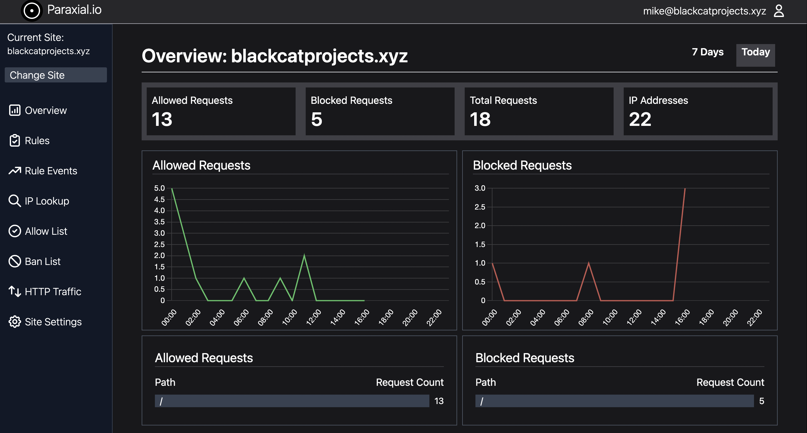

# User Manual 

## Introduction 

Welcome to the Paraxial.io user manual. This document focuses on using Paraxial.io to effectively block malicious traffic to a site, and requires you to first install the Paraxial.io agent. 

---

### Index

1. Definitions

2. Creating a New Site

3. The Overview Page

4. Defining Rules

5. Rule Events

6. Allow/Block List

7. HTTP Traffic

8. Site Settings

9. Webhooks

10. Exclude data collection for specific routes

11. Honeypot URLs

12. Exploit Guard 

13. FAQ

---

## 1. Definitions

**Site** - An Elixir/Phoenix/Plug web application that has the Paraxial agent installed and running. You create a site through the Paraxial web interface, provide the site API key to the Paraxial agent, and a connection is established between the Paraxial server and your application. A site has many rules, allowed IP addresses, banned IP address, and site members.

**Rule** - A user defined condition such as, "If one IP address sends > 20 POST requests to `/users/log_in` in a period of 5 seconds, create an alert and ban the IP address." A benefit of Paraxial over traditional systems is that if an IP sending hundreds of requests per second, it will only be permitted to send 20 requests, the 21st will be banned. Compare this with a periodic database query, which would allow hundreds of requests before banning the client.

**Rule Event** - When an IP address matches a rule, such as, "If an IP sends > 20 POST requests to `/users/log_in` in a period of 5 seconds, alert and ban", a rule event is created. The rule event contains information about what caused the rule to be triggered.

**Allow List** - A list of IP prefixes defined by the user. If an IP matches a prefix on this list, it will always be allowed through. Supports IPv4 and IPv6 prefixes.

**Ban List** - Similar to Allow List, matching requests will never succeed. Supports IPv4 and IPv6 prefixes.

**Site Admin** - Has full control over the site.

**Site User** - Limited control over a site, for example this user cannot delete the site.

## 2. Creating a New Site

When you first create a site, select an appropriate name and timezone. Navigate to "Site Settings", and note the site API key. You will use it to install the Paraxial agent. 

## 3. The Overview Page



The Paraxial.io overview page shows several interesting facts about your site, including:

- Allowed and blocked requests
- Total IP addresses
- Hourly and daily charts

Click the "7 Days" link in the upper right hand corner to switch to the week view. 

## 4. Defining Rules
Paraxial.io allows users to define "Rules", which are conditions in their web application related to incoming HTTP traffic. The following are examples of rules:

1. `If an IP sends > 5 POST requests to /accounts/new_user in a 20 second period, create an alert.`

2. `If an IP sends > 10 requests of any HTTP method to /projects/*/export in a 12 second period, create an alert and ban the IP address.`

3. `If an IP sends > 100 requests of any HTTP method to any path in a 5 second period, ban the IP address.`

The purpose of defining rules is to prevent a malicious client from sending an excessive number of unwanted requests. Some examples of requests that you may want to throttle may be related to:

- Login attempts
- New account creation
- Credit card transactions
- Email sending
- Expensive computation
- Excessive total requests (scraping, vulnerability scanning)
- Denial of service attacks

### The Rule Creation Form:

To create a rule, navigate to:

`app.paraxial.io/site/:your_site/new_rule`

You should see a form that says `Create new rule for :your_site`, with some fields. These are:

1. `Rule name` - A user provided string, it should be a descriptive comment on what the rule intends to do.
2. `N requests` - The number of requests one IP address can make in the given time period before matching the rule.
3. `Time period in seconds` - If you wish to limit login requests to 10 every 5 seconds, this value should be 5.
4. `Path` - The path of the incoming request. Uses a custom pattern matching language detailed below.
5. `HTTP Methods` - Examples include GET, PUT, POST. Uses a custom pattern matching language detailed below.
6. `On trigger` - When the rule is matched, you may create an alert, ban the IP, or do both.

### Example Rule Creation

To create the rule `If an IP sends > 5 POST requests to /accounts/new_user in a 20 second period, create an alert and ban the IP address`, the following form values are used:

1. `Rule name` - This is an arbitrary value, written to be understood by users of Paraxial.io. You could name this "Alert and ban on excessive logins in short period", or "ATO > 5 in 20s to /accounts/new_user". The behavior of the rule is independent of this string, similar to comments in a programming language. 

2. `N requests` - `5`

3. `Time period in seconds` - `20`

4. `Path` - `/accounts/new_user` - This must be entered exactly as provided here. If your value does not start with a `/`, it will be rejected. More details are below on how path matching works.

5. `HTTP Methods` - `POST` - This must be entered exactly as provided here. More details on http method matching below.

6. `On trigger` - `Create an alert and ban the IP`

### Field Details 

#### N requests
`N requests` must be > 0 and < 999. 

#### Time period in seconds
`Time period in seconds` must be > 0 and < 86,400.

#### Path
The "Path" field uses a custom language for matching on paths. Examples are:

---
Path `*` - Match any path.

Matching:
- `paraxial.io/new_user`
- `paraxial.io/site/paraxial.io/settings`
- `paraxial.io/site/paraxial.io/edit_users/update`

---
Path `/new_user` - Only matching incoming requests for the route `new_user`.

Matching:
- `paraxial.io/new_user`
- `paraxial.io/new_user/`
- `paraxial.io/new_user//`
- `paraxial.io/new_user///`

Will not match:
- `paraxial.io/new_user/a/new_user`
- `paraxial.io/new_user/!`
- `paraxial.io/new_user/a`

---
Path `/site/*/settings` - Matching incoming requests for the route `/site/:any_value/settings`.

Matching:
- `paraxial.io/site/paraxial.io/settings`
- `paraxial.io/site/paraxial.io/settings/`
- `paraxial.io/site/customsitehere.com/settings`
- `paraxial.io/site/customsitehere.com/settings/`

Will not match:
- `paraxial.io/site/paraxial.io`
- `paraxial.io/site/paraxial.io/settings/edit_users`

---
Path `/site/*/settings/*` - Matching incoming requests for the route `/site/:any_value/settings/:any_value`.

Matching:
- `paraxial.io/site/paraxial.io/edit_users`
- `paraxial.io/site/paraxial.io/list_users`

Will not match:
- `paraxial.io/site/paraxial.io/edit_users/update`
- `paraxial.io/site/paraxial.io`

#### HTTP Methods

The `HTTP Methods` field takes a list of comma separated HTTP method names, such as: 

`GET, POST, PUT`

for use in rule matching. It also supports the wildcard `*` character, to match all HTTP methods. These are:

`GET, HEAD, POST, PUT, DELETE, CONNECT, OPTIONS, TRACE, PATCH`

To match all HTTP methods, input: `*`

To match GET only, input: `GET`

To match GET and POST, input: `GET, POST`

To match GET, POST, and PUT, input: `GET, POST, PUT`

#### On Trigger
There are three options for `On Trigger`:

1. Create alert and ban the IP
2. Only alert, do not ban
3. Only ban, do not alert

## 5. Rule Events
The rule events page lists useful information about why an IP address matched a rule. This includes:

1. The rule that was matched
2. How many requests the IP sent in the rule time period
3. If the IP is currently on the allow or ban lists
4. Associated login attempts from the IP, if `paraxial_login_user_name` and `paraxial_login_success` assigns are in use by your application
5. The matching HTTP requests, with timestamps  

## 6. Allow/Block List
The IP block and allow lists support IPv4 and IPv6 prefixes. Examples include:

- `3.5.140.0/22`
- `2600:1f14:fff:f800::/56`

## 7. HTTP Traffic
This page displays the most recent 1,000 HTTP events for your site. For each request, you can see:

1. IP Address
2. HTTP method
3. Path requested
4. Status code (200, 404, etc.)
5. Currently logged in user, if `paraxial_current_user` assigns is used
6. User Agent
7. If the request was allowed 
8. IP Class, set if the IP matches a cloud provider (AWS, GCP, etc.)
9. Timestamp

## 8. Site Settings
Current settings are:

1. Change site timezone
2. Delete site (and all associated site data)
3. Add/remove users to your site
4. Configure Webhooks

## 9. Webhooks

To configure webhook URLs:

`Site > Site Settings > Edit Webhooks`

The outbound POST request will be sent on rule events with "alert" configured. That is, "Create an alert and ban the IP" or "Only alert, do not ban". If you need a fast way to test this locally, [nrgok](https://ngrok.com/) is useful. 

Bot Defense Rule Webhook:

```
{
    "event_uuid": "a14c3232-cb2a-42e6-834c-01f008481add",
    "failed_logins": {
        "attacker2@bots.io": 1,
        "attacker@bots.io": 1
    },
    "http_methods": ".*",
    "ip_address": "3.5.140.2",
    "max_requests": 10,
    "on_trigger": "alert",
    "path": "^/+users/+log_in/*$",
    "recorded_request_count": 12,
    "rule_name": "Too many login",
    "site_name": "local.house.com",
    "successful_logins": {
        "mike@blackcatprojects.xyz": 1
    },
    "time_seconds": 30,
    "timestamp": "2022-09-01 16:46:45-04:00 EDT"
}
```

`event_uuid`: Corresponds to the rule event UUID in the GUI

`failed_logins`: List of email addresses, and the number of failed logins for each, for the past 7 days

`http_methods`: The HTTP methods (GET, POST, PUT) that match the defined rule

`ip_address`: The IP of the client that triggered the alert

`max_requests`: The maximum number of requests a client may send before triggering the rule

`on_trigger`: Can be "alert", "ban", or "alert_ban"

`path`: The Phoenix router path for matching requests

`recorded_request_count`: The number of requests the client sent to trigger the alert

`rule_name`: The user-defined name of the rule

`site_name`: The user-defined name of the site the rule event was created for

`successful_logins`: List of email addresses, and number of successful logins for each, for past 7 days

`time_seconds`: The duration of the rule for request matching

`timestamp`: The time the rule was triggered, timezone determined by site settings


Exploit Guard Webhook:

```
{
  "exploit_uuid": "7915e8eb-6e53-43b7-a67b-1ae7825859d3",
  "message": "\n13:38:54.294726 <0.908.0> erlang:binary_to_term(<<131,112,.. 0>>)\n",
  "mode": "block",
  "site_name": "potionshop",
  "timestamp": "2023-06-06 13:38:54-04:00 EDT"
}
```

`exploit_uuid`: Corresponds to the exploit UUID in the GUI

`message`: Metadata about the function that was created at runtime

`mode`: The mode (monitor or block) of the agent when the exploit data was captured

`site_name`: The user-defined name of the site matching this exploit 

`timestamp`: The time the event was triggered, timezone determined by site settings

## 10. Exclude data collection for specific routes

The pricing on Paraxial.io is by the number of good events sent by the agent to the backend. A good event means one HTTP request sent to your web app. So if 5 users send a total of 50 requests, that's 50 good events. If a spammer sends 5,000 blocked requests, those don't count. By default, the agent sends all HTTP requests to the backend.

To only collect data for specific routes, set your configuration at compile time to the code below, by editing your `config/dev.exs`, `config/test.exs`, and `config/prod.exs` files. 

Do NOT set `only:` or `except:` at runtime, the agent uses metaprogramming to generate code at compile time. If you set `only:` or `except:` at runtime, the agent will ignore the config and send data for all routes. As of `2.0.0`, you will get an error (see below).

To have the agent only send data to the backend for the following:

- GET /users/log_in
- POST /users/log_in
- GET /users/:id/settings

```elixir
config :paraxial,
  paraxial_api_key: System.get_env("PARAXIAL_API_KEY"),  
  ... 
  only: [
    %{path: "/users/log_in", method: "GET"},
    %{path: "/users/log_in", method: "POST"},
    %{path: "/users/:id/settings", method: "POST"}
  ]
```

To send events for all routes, except the following:

- GET /health_check
- GET /users/:id/status

```elixir
config :paraxial,
  paraxial_api_key: System.get_env("PARAXIAL_API_KEY"),  
  ... 
  except: [
    %{path: "/health_check", method: "GET"},
    %{path: "/users/:id/status", method: "GET"}
  ]
```

After changing `only/except` in your compile time configuration, you must run:

```
mix deps.compile paraxial --force
```

Or you will get an error:

```
@ air % mix phx.server
ERROR! the application :paraxial has a different value set for key :except during runtime compared to compile time. Since this application environment entry was marked as compile time, this difference can lead to different behaviour than expected:

  * Compile time value was not set
  * Runtime value was set to: [%{method: "GET", path: "/health_check"}, %{method: "GET", path: "/users/:id/status"}]

To fix this error, you might:

  * Make the runtime value match the compile time one

  * Recompile your project. If the misconfigured application is a dependency, you may need to run "mix deps.compile paraxial --force"

  * Alternatively, you can disable this check. If you are using releases, you can set :validate_compile_env to false in your release configuration. If you are using Mix to start your system, you can pass the --no-validate-compile-env flag
```

Note that you should only define rules for routes that have collection enabled. If you define a rule for a route, but disable collection for it, the rule will not work correctly. 

If an attacker is banned due to triggering a rule, the attacker will be banned from all routes in your application, even if collection is not enabled for those routes.

## 11. Honeypot URLs

Honeypot URLs are used to create forms that are only visible by bots, not human visitors. Bots will fill in and submit the form, then be banned by Paraxial.io, preventing them from spamming your real forms. 

Note: For honeypot URLs to work you should have already gone through `Bot Defense Setup`. Search your `endpoint.ex` file for `plug Paraxial.AllowedPlug` to confirm you completed that step. 

### 1. Create the URL in your application

Site settings > Honeypot URLs > Edit > Create URL

Looks like:

`https://app.paraxial.io/api/form_submit/e371b5a4-b698-4c60-8072-f024fad67fae`

### 2. Find a controller that does not require auth, create the following action:

```
def honeypot_ban(conn, _params) do
  url = YOUR_URL_HERE 
  body = Jason.encode!(%{"bad_ip" => Tuple.to_list(conn.remote_ip)})
  headers = [{"Content-Type", "application/json"}]
  Task.start(fn -> HTTPoison.post!(url, body, headers) end)
  json(conn, %{ok: "system online"})
end
```

### 3. In your router, find a scope that goes through the :browser pipeline (for CSRF protection) and does not require auth, for example:

```
  scope "/", ParaxWeb do
    pipe_through :browser

    post "/customer", PageController, :honeypot_ban
  end
```

### 4. Create the form, with CSRF protection

Email/password example: 

```
<%= form_for @conn, Routes.page_path(@conn, :honeypot_ban), [style: "display:none !important"], fn f -> %>
  <%= text_input f, :email, tabindex: -1 %>
  <%= text_input f, :password, tabindex: -1 %>
  <%= submit "Register" %>
<% end %>
```

LiveView version:
```none
def render(assigns) do
  ~H"""
  <.form for={@form} id="customer_form" action={~p"/customer"} style="display:none !important">
    <.input field={@form[:email]} type="email" label="Email" tabindex="-1" />
    <.input field={@form[:password]} type="password" label="Password" tabindex="-1" />
    <button>Register</button>
  </.form>
  ...
```

```
# @form needs a value
def mount(_params, _session, socket) do
  form = to_form(%{}, as: "user")
  {:ok, assign(socket, form: form)}
end
```

## 12. Exploit Guard

Exploit Guard provides runtime application self protection for your application. To use Exploit Guard, ensure your agent version is >= `2.4.0`.

Exploit Guard has two configurations, `:monitor` or `:block`:

`monitor` - No action will be taken, this is the "read only" option.

`block` - The process where the new function was created will be killed.

When Exploit Guard detects a new function is created at runtime, an alert will be sent to your Paraxial.io site. If you have a webhook configured, a POST request will be sent. 

Example:

```elixir
config :paraxial,
  paraxial_api_key: "API_KEY",  
  exploit_guard: :monitor
```

To trigger an Exploit Guard event for testing, start your application with:

```
% iex -S mix
...
[info] [Paraxial] Exploit Guard set to block mode
...
iex(1)> a = :erlang.term_to_binary(fn x -> x end)  # Enter this line
<<131, 112, 0, ...>>
iex(2)> :erlang.binary_to_term(a)                  # Enter this line
```

Now view the output:

```
iex(3)> [alert] [Paraxial] Exploit behavior detected, binary_to_term created function
[alert] [Paraxial] Exploit info: 
13:36:14.732438 <0.736.0> erlang:binary_to_term(<<131,112,0 ...
[alert] [Paraxial] Block mode active, exploit process killed
[alert] [Paraxial] Exploit behavior detected, binary_to_term created function
[alert] [Paraxial] Exploit info: 
13:36:14.742337 <0.736.0> erlang:binary_to_term/1 --> #Fun<erl_eval.42.3316493>

[alert] [Paraxial] Block mode active, exploit process killed
** (EXIT from #PID<0.736.0>) shell process exited with reason: killed
Interactive Elixir (1.13.0) - press Ctrl+C to exit (type h() ENTER for help)
iex(1)> 
```

Visit `Site > Exploit Guard` to view the event. 

Note that the agent was set to block mode, so the relevant exploit process was killed. For more information on how RCE exploits work in Elixir, see the article "Elixir/Phoenix Security: Remote Code Execution and Serialisation" - https://paraxial.io/blog/elixir-rce

## 13. FAQ

### Do my users need to wait for a round trip network connection because of Paraxial.io?

No, the analysis takes place in the agent, there is no round-trip network connection required. 

### What happens in my application if the Paraxial.io agent cannot communicate with the Paraxial.io backend?

The agent will fail open, so your application will continue to function as it normally would without the agent installed. 

### How long is my site's data stored?
Seven days, after which it is automatically deleted. 
