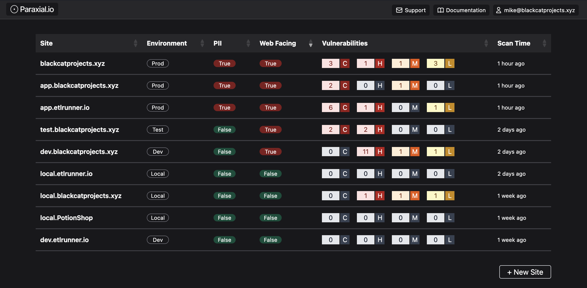
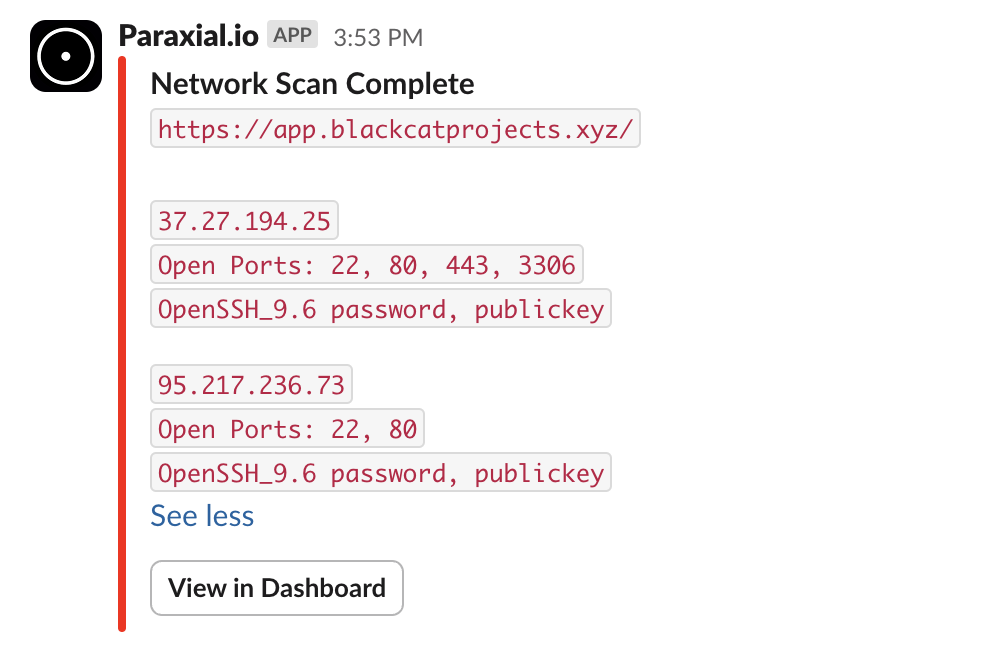

# Why Use Paraxial.io for Elixir

An Elixir/Phoenix web application that is exposed to the public internet will be attacked. This is the reality of the modern web, any software you expose must have safeguards. Security is a large and complicated subject, if you are thinking "I don't even know where to start with security", do not worry, you have come to the right place. 

Consider a SaaS business, Black Cat Projects, which makes project management software. Below are examples of security incidents and how Paraxial.io would prevent each one:

<br>

### Lack of asset management leads to forgotten app being compromised

Black Cat Projects has two codebases: `havana`, the main application, and `ticker`, a microservice that pulls metrics from the database for a dashboard. The company focuses all the security efforts on `havana`, doing security reviews, having it pentested by a 3rd party firm, and keeping the software up to date. `ticker` is neglected, and it runs an outdated version of Elixir and Phoenix. 

`ticker` contains a vulnerability that is trivial to exploit, a command injection that leads to full server compromise. One day an attacker notices this microservice, hacks into it, and gets SSH access to the EC2 host. The network is not segmented well, meaning the attacker is able to further compromise the production server, and steal the entire database, causing a breach. 

**How would Paraxial.io prevent this?**

All your internet-facing web applications should be catalogued in Paraxial.io:



Paraxial.io would communicate that `ticker` was not being scanned for security issues. Even if nobody was logging into Paraxial.io on a frequent basis, the [weekly email report](https://paraxial.io/blog/email-report) would show that an internet-facing project was not being checked for security issues. 

<br>

### Exposed PostgreSQL endpoint leads to data breach

The recommended best practice for using a database in production is:

`User HTTP request ---> App Server <--- private connection ---> Database server`

Where the database server is never exposed to the public internet. The benefit of this architecture is that even if there is a security problem with PostgreSQL, it will most likely require the database server to be public for an attacker to exploit it, so isolating the server reduces this risk.

However, you can just run PostgreSQL on the application server. Now imagine a misconfiguration, where the PostgreSQL port 5432 is open to the public internet, and the db server has a weak password. A bad guy scans for the server, is able to brute force the password (it was something weak like `postgres`), and steals the entire database.

**How would Paraxial.io prevent this?**

The [Network Scans](./../network_scans.md) feature would detect port 5432 is open to the public internet. While the engineering team at Black Cat Projects thought this port was closed, it is always better to verify. Paraxial.io automatically scans the server daily or weekly, so if a port is opened by accident it will be detected. 



As you can see from the above scan, 5432 is closed, but having 3306 and 22 exposed to the public internet (with password authentication for SSH) is not ideal. 

For more information about server security, see the article [Security Best Practices for Deploying Rails 8 on Linux with Kamal](https://paraxial.io/blog/kamal-security), the guidance is applicable to Elixir as well. 

<br>


### Vulnerable dependency leads to remote code execution (RCE)

Black Cat Projects decides to use GitHub's dependabot for dependency security in their Elixir projects. After all, it seems compatible: 


There is a critical vulnerability here that dependabot cannot detect because [dependency graph does not support Elixir.](https://paraxial.io/vs-github)

In the above screenshot dependabot generated a lot of noise about non-security related upgrades, but misses the security issue:


The paginator library is vulnerable to remote code execution (RCE), which is the worst case scenario for a web application. An attacker can use this vulnerability to get the equivalent of production SSH access. In a sense, dependabot was worse than nothing, because it gives a false sense of security while failing to notify users of critical security issues. 

**How would Paraxial.io prevent this?**

Paraxial.io will only notify you when there is a security issue in your dependencies: 


Paraxial.io does not spam you with non-security related upgrade info the way dependabot does.


<br>

### Remote code execution via :erlang.binary_to_term

Consider the following code:

```
defmodule CarafeWeb.PotionController do
  use CarafeWeb, :controller

    def vendors(conn, %{"cursor" => c}) do
    cursor_bin = Base.decode64!(c)
    cursor = :erlang.binary_to_term(cursor_bin, [:safe])
    cursor_list = Enum.to_list(cursor)
    first = Enum.min(cursor_list)
    last = Enum.max(cursor_list)

    vendors = Vendors.get_vendors()
    rv = Enum.slice(vendors, cursor)
    render(conn, "vendors.html", vendors: rv, first: first, last: last)
  end
```

What is the impact of this vulnerability? 

If you answered "remote code execution via `:erlang.binary_to_term`, you're correct! The `[:safe]` option is misleading, it only prevents the creation of new atoms, it does not stop the creation of executable terms. The impact of this vulnerability is that an attacker can execute shell commands on the server, leading to the equivalent of production SSH access, causing a data breach. 

**How would Paraxial.io prevent this?**

The Paraxial.io GitHub App can run Sobelow, the static code analyzer, on each new pull request via CI/CD. On it's own the Sobelow finding does not explain how severe this problem is:

```
Confidence: high_confidence
File: lib/carafe_web/controllers/potion_controller.ex
Line: 29
Type: Misc.BinToTerm: Unsafe `binary_to_term`
Variable: cursor_bin
```

Paraxial.io gives a detailed explanation of the vulnerability, with advice on how to fix it:


If you would like to learn more about this type of vulnerability, see [Elixir/Phoenix Security: Remote Code Execution and Serialisation.
](https://paraxial.io/blog/elixir-rce)

<br>


### User accounts compromised via credential stuffing

Does your application have a login form, where users enter their email and password? If it does, you will have to deal with bots performing [credential stuffing](https://en.wikipedia.org/wiki/Credential_stuffing) attacks. The idea is that most people re-use passwords across sites, and data breaches are common enough that user's old passwords can be found online. For example, a user signed up for a golf forum with the credentials `jack@example.com, golf1234567` several years ago. The forum was hacked, and that credential is now public. One day you receive thousands of login attempts per hour, where each attempt is for a different account. The bad guy is searching for users who re-used their password. 

**How would Paraxial.io prevent this?**

The bot defense feature of Paraxial.io gives you several tools to stop this attack:

- Rate limiting 

- Banning malicious bots (sending requests for .php endpoints)

- Banning requests from data center IPs

- Honeypot HTML forms

See [Getting Started - Bot Defense](./started_bot.md) for more information. 
