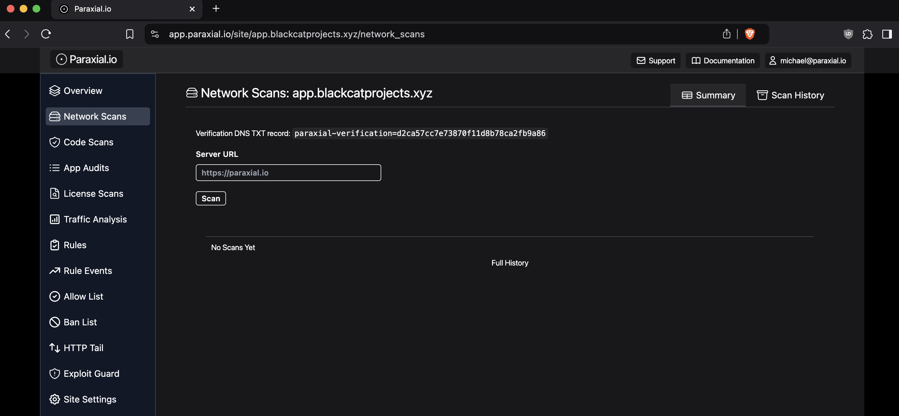
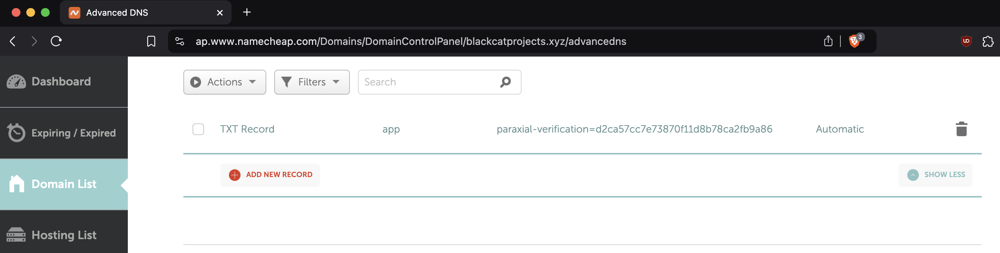
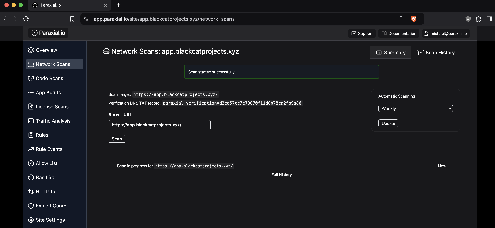
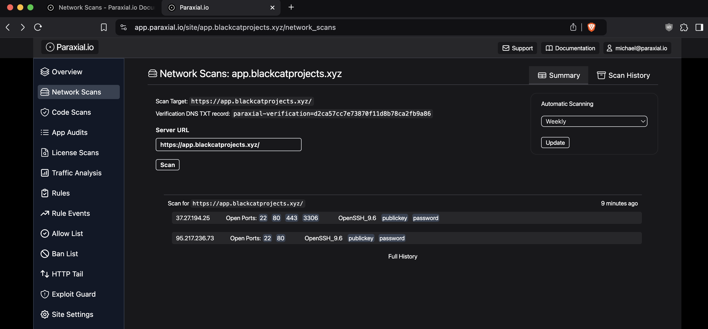

# Network Scans

Before starting with network scans, determine if your application is hosted on a server where you control which ports are exposed to the public internet, or a Platform as a Service (PaaS).

PaaS: Heroku, Render, Fly.io, Railway, Gigalixir 

VPS: AWS, GCP, Hetzner, Azure, Digital Ocean 

If your hosting provider is in the "PaaS" group, network scanning is not applicable to your application, because you don't have access to the host operating system and network configuration. If you are on a VPS, then using network scanning is recommended. 

## Setup

To get started, create your site and go to the "Network Scans" page:



The Server URL value does not have to match the name of the site. To verify that you own the URL being scanned, you have to create a DNS TXT record for `paraxial-verification=your_value_here`. If the URL being scanned is a sub-domain, you will have to create the TXT record on that subdomain. For example:

https://app.blackcatprojects.xyz/

I'm using Namecheap as a domain provider, your settings may be different:



To verify that the DNS record has been updated, you can run:

`$ dig TXT app.blackcatprojects.xyz`

```
@ parax_aws % dig TXT app.blackcatprojects.xyz
...

;; ANSWER SECTION:
app.blackcatprojects.xyz. 1799	IN	TXT	"paraxial-verification=d2ca57cc7e73870f11d8b78ca2fb9a86"

...
```

Note that it may take a few minutes. Once the record is set you can run your first scan:



A scan takes 10 - 15 minutes to run, because it is checking all open ports. The results will be displayed in the Network Scans tab:



Setup the [Slack App](./slack_app.md) to receive the scan results in your designated channel:  


## FAQ

Q: What ports should be exposed to the public internet? 

For most applications, you only want to have ports 80 and 443 exposed to the public internet, with port 22 only accessible on your home IP address. This is not always feasible, and if SSH must be accessible to the public internet, it is recommended that you only use public key authentication, because it reduces the risk of you accidentally using a weak password. The article [Security Best Practices for Deploying Rails 8 on Linux with Kamal](https://paraxial.io/blog/kamal-security) on the Paraxial.io blog goes into more detail on these best practices. 

<br>

Q: When do the daily and weekly scans run?

Daily scans run at 6pm UTC (1pm EST)

Weekly scans run every Tuesday at 7pm UTC (2pm EST)
