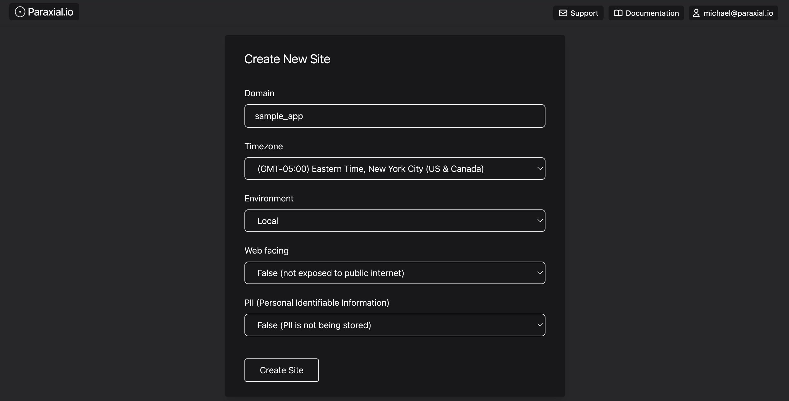
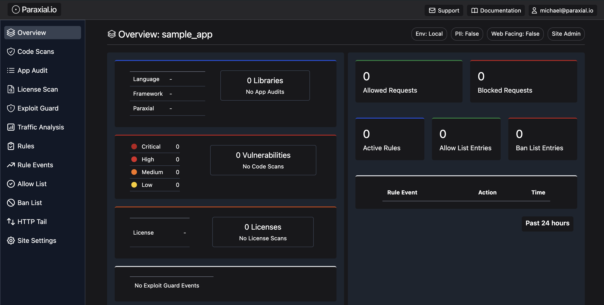
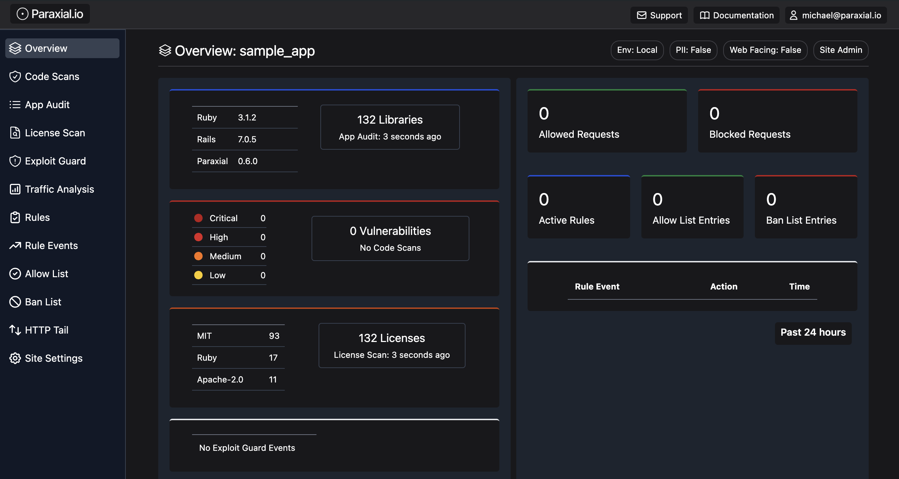
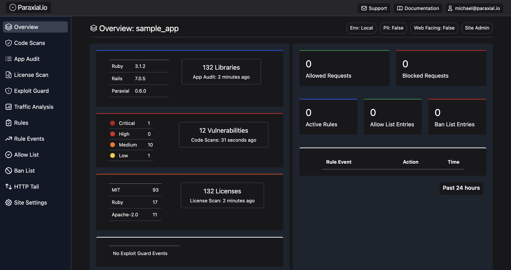
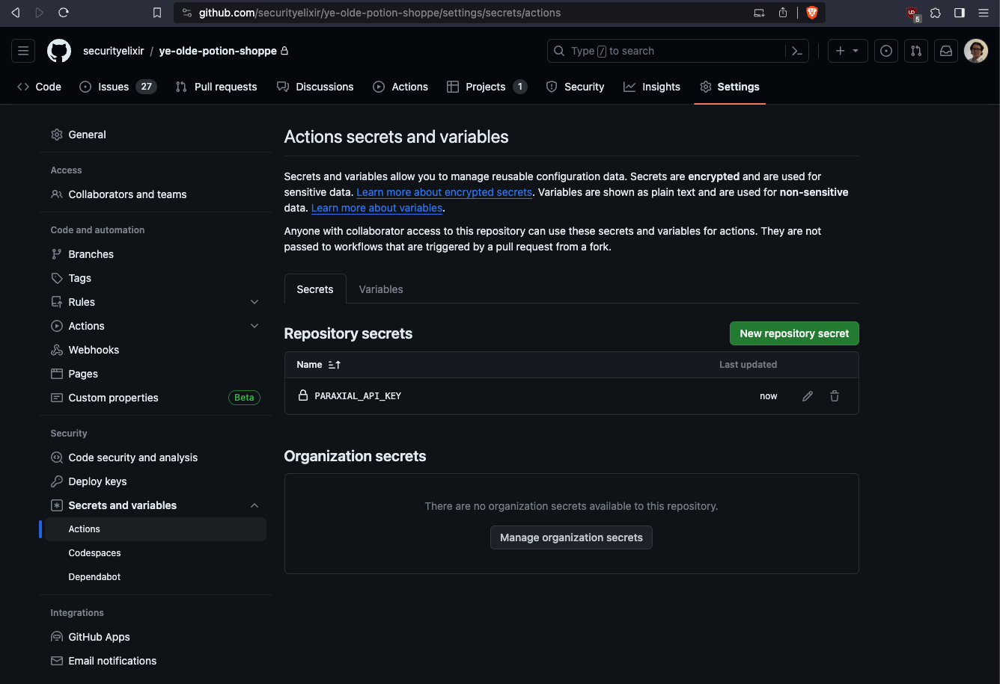
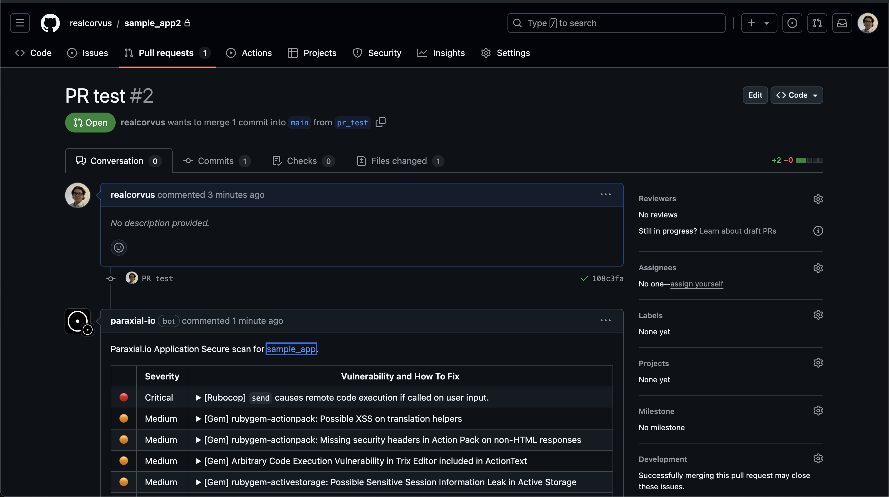
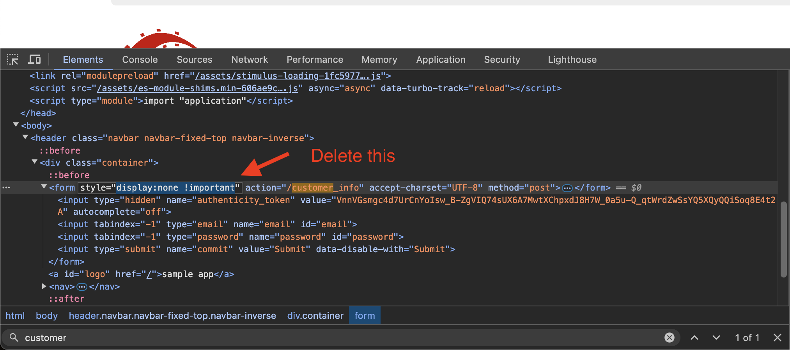
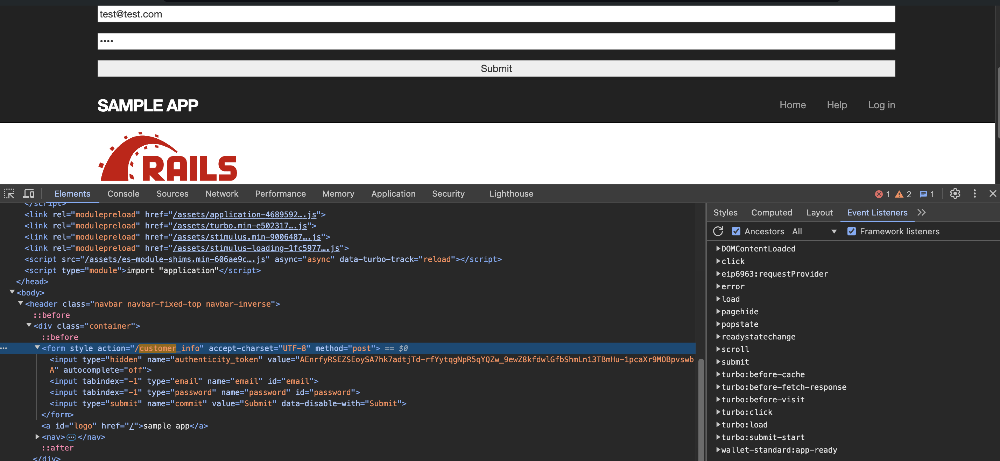
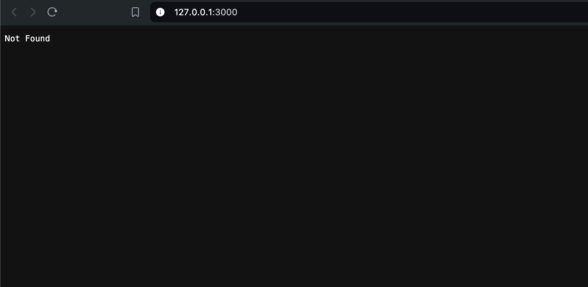
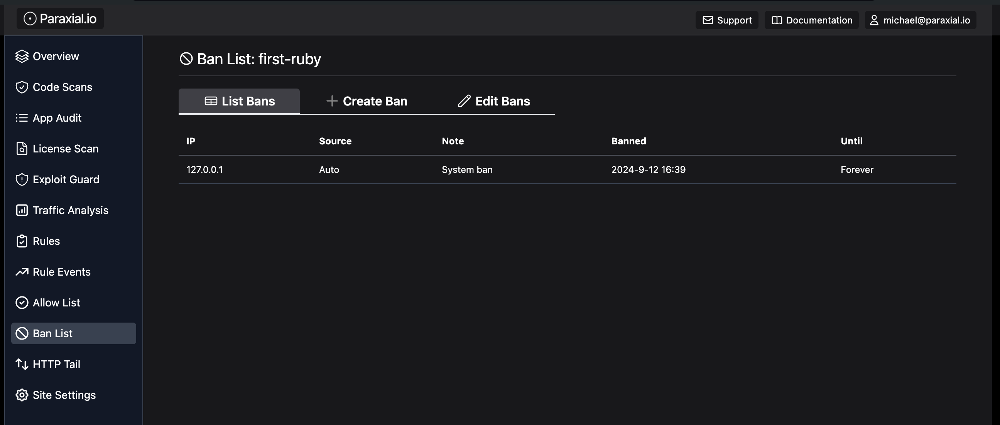

# Getting started with Paraxial.io (Ruby)

This tutorial is a step-by-step guide to setup Paraxial.io with a Ruby on Rails application. It will walk through creating an account, installing the agent, and getting results flowing to the backend. Functionality is limited in the free tier, for example you cannot send HTTP traffic to the Paraxial.io backend for analysis.

## Free Tier Limits

1. Maximum of 2 Sites.
2. You cannot invite users to a Site.
3. HTTP traffic cannot be ingested by the backend.
4. Limit of 30 scans per site, per month. 

If you have questions about Paraxial, need enterprise support, or would like to upgrade your plan, email `support@paraxial.io`.

## 1. Create your Paraxial.io account 

Go to [https://app.paraxial.io/](https://app.paraxial.io/) in your web browser. Create a new account. You will receive a confirmation email, use it to confirm your account and sign in. You have no sites at this point. 

## 2. Create your site

Create a new site, but pick a different domain besides `sample_app`. Note that the `domain` is really treated as a comment by Paraxial.io, you can put any value you want here, it does not have to be a valid URL and no HTTP requests are ever sent to it.





## 3. Sample App install

This section is to setup the reference sample app for the Ruby on Rails Tutorial (7th edition) by Michael Hartl. If you are installing Paraxial.io in your own project you can skip this section.

GitHub - [https://github.com/learnenough/rails_tutorial_sample_app_7th_ed](https://github.com/learnenough/rails_tutorial_sample_app_7th_ed)


```
% git clone https://github.com/learnenough/rails_tutorial_sample_app_7th_ed 
% cd rails_tutorial_sample_app_7th_ed/

Gemfile
% gem "rails",                      "7.0.4" # bump to 7.0.5 for Apple M1 CPU
% rm -rf Gemfile.lock 

% bundle 
% rails db:migrate
% rails db:seed
% rails server
```

## 4. Install Paraxial.io

Paraxial.io for Ruby is hosted on RubyGems - [https://rubygems.org/gems/paraxial](https://rubygems.org/gems/paraxial)

Current version: `1.0.2`

`Gemfile`
```
...
gem 'paraxial', '~> 1.0'

...
```

Find your API key in "Site Settings". 

`export PARAXIAL_API_KEY=your_key_here`

Create `.rubocop.yml` and add:

```
% cat .rubocop.yml 
require:
- rubocop-erb
```

This is so Paraxial.io can scan ERB files for security issues.

Start your application:

`rails s`

Then check your site page:



You should see data for libraries and open source licenses. 

Now run a scan:

```
% paraxial scan
[Paraxial] Scan starting...
[Paraxial] .rubocop.yml is valid.

[Paraxial] Scan count: 12

(Gemfile.lock) actionpack: Possible XSS via User Supplied Values to redirect_to - 7.0.5
- Title: actionpack: Possible XSS via User Supplied Values to redirect_to
- Installed Version: 7.0.5
- Fixed Version: ~> 6.1.7.4, >= 7.0.5.1

(Gemfile.lock) rubygem-actionpack: Possible XSS on translation helpers - 7.0.5
- Title: rubygem-actionpack: Possible XSS on translation helpers
- Installed Version: 7.0.5
- Fixed Version: ~> 7.0.8, >= 7.0.8.1, >= 7.1.3.1

(Gemfile.lock) rubygem-actionpack: Missing security headers in Action Pack on non-HTML responses - 7.0.5
- Title: rubygem-actionpack: Missing security headers in Action Pack on non-HTML responses
- Installed Version: 7.0.5
- Fixed Version: ~> 6.1.7, >= 6.1.7.8, ~> 7.0.8, >= 7.0.8.4, ~> 7.1.3, >= 7.1.3.4, >= 7.2.0.beta2

(Gemfile.lock) Arbitrary Code Execution Vulnerability in Trix Editor included in ActionText - 7.0.5
- Title: Arbitrary Code Execution Vulnerability in Trix Editor included in ActionText
- Installed Version: 7.0.5
- Fixed Version: ~> 7.0.8.3, >= 7.1.3.3

(Gemfile.lock) rubygem-activestorage: Possible Sensitive Session Information Leak in Active Storage - 7.0.5
- Title: rubygem-activestorage: Possible Sensitive Session Information Leak in Active Storage
- Installed Version: 7.0.5
- Fixed Version: ~> 6.1.7, >= 6.1.7.7, >= 7.0.8.1

(Gemfile.lock) rubygem-activesupport: File Disclosure of Locally Encrypted Files - 7.0.5
- Title: rubygem-activesupport: File Disclosure of Locally Encrypted Files
- Installed Version: 7.0.5
- Fixed Version: ~> 6.1.7, >= 6.1.7.5, >= 7.0.7.1

(Gemfile.lock) Bootstrap Cross-Site Scripting (XSS) vulnerability - 3.4.1
- Title: Bootstrap Cross-Site Scripting (XSS) vulnerability
- Installed Version: 3.4.1
- Fixed Version: 

(Gemfile.lock) rubygem-puma: HTTP request smuggling when parsing chunked transfer encoding bodies and zero-length content-length headers - 5.6.4
- Title: rubygem-puma: HTTP request smuggling when parsing chunked transfer encoding bodies and zero-length content-length headers
- Installed Version: 5.6.4
- Fixed Version: ~> 5.6.7, >= 6.3.1

(Gemfile.lock) rubygem-puma: HTTP request smuggling when parsing chunked Transfer-Encoding Bodies - 5.6.4
- Title: rubygem-puma: HTTP request smuggling when parsing chunked Transfer-Encoding Bodies
- Installed Version: 5.6.4
- Fixed Version: ~> 5.6.8, >= 6.4.2

(Gemfile.lock) rubygem-actionpack: Possible XSS on translation helpers - 7.0.5
- Title: rubygem-actionpack: Possible XSS on translation helpers
- Installed Version: 7.0.5
- Fixed Version: 7.0.8.1, 7.1.3.1

(Rubocop) CSRF, no protect_from_forgery in ApplicationController.
- Path: app/controllers/application_controller.rb
- Line: 1

(Rubocop) `send` causes remote code execution if called on user input.
- Path: app/models/user.rb
- Line: 49

[Paraxial] Scan UUID your_value_here
[Paraxial] Scan URL your_url_here
```



## 5. GitHub App

The Paraxial.io App can be installed in an organization or individual account. 

GitHub Marketplace - [https://github.com/marketplace/paraxial-io](https://github.com/marketplace/paraxial-io)


Note the install_id of `45554672`. Your value will be different. Make a note of this value somewhere, you will need it later.

The Paraxial.io Github App is compatible with all CI/CD pipelines. We will be using a Github Action in this example. The following is required:

1. Paraxial.io App Install ID (`45554672` in this example, your value will be different)
2. Repo Owner
3. Repo Name
4. Pull Request number

The dynamic values should be accessible in your CI environment. 

**Put the Paraxial.io API key in GitHub Actions Secrets**

This secret key is found in "Site Settings" in the Paraxial.io web interface. 




**Configure the GitHub Action**

Before continuing, answer the following questions:

<br>

Q: What is the name of your repo's primary branch? (It is probably `master` or `main`) 

If your repo's branch is different, replace the "branches" value.

Q: What is your Paraxial.io Github App Install ID? 

See the section above 

<br>

GitHub Action: 

```
% mkdir -p .github/workflows
% touch .github/workflows/paraxial.yml
```

```
name: Paraxial.io Application Secure

on:
  push:
    branches: [ "main" ]
  pull_request:
    branches: [ "main" ]

permissions:
  contents: read

jobs:
  build:

    name: Build and test
    runs-on: ubuntu-latest

    env:
      PARAXIAL_API_KEY: ${{ secrets.PARAXIAL_API_KEY }}

    steps:
    - uses: actions/checkout@v3
    - name: Set up Ruby
      uses: ruby/setup-ruby@v1 
      with:
        ruby-version: '3.1.2' 

    - name: Install dependencies
      run: bundle install

    - name: Get Github Repo Name
      run: echo "REPO_NAME=$(echo ${{ github.repository }} | cut -d'/' -f2)" >> $GITHUB_ENV

    - name: Paraxial.io Scan, pull request does not exists
      if: "${{ github.event.number == '' }}"
      run: |
        paraxial scan

    - name: Paraxial.io Scan, pull request exists 
      if: "${{ github.event.number != '' }}"
      run: |
        paraxial scan --github_app \
          --install_id YOUR_VALUE_HERE \
          --repo_owner ${{ github.repository_owner }} \
          --repo_name ${{ env.REPO_NAME }} \
          --pr_number ${{ github.event.number }} \
          --exit-code 
```

The flag `--exit-code` will cause the CI/CD run to fail if findings are detected by returning an exit code of 1. This can be used to block pull requests that contain security issues. 

Example of a successful run in GitHub actions:

```
Run paraxial scan --github_app \
  paraxial scan --github_app \
    --install_id 45233668 \
    --repo_owner realcorvus \
    --repo_name sample_app2 \
    --pr_number 1
    
  shell: /usr/bin/bash -e {0}
  env:
    PARAXIAL_API_KEY: ***
    REPO_NAME: sample_app2
[Paraxial] Scan starting...
[Paraxial] .rubocop.yml is valid.

[Paraxial] Scan count: 12

(Gemfile.lock) actionpack: Possible XSS via User Supplied Values to redirect_to - 7.0.5
- Title: actionpack: Possible XSS via User Supplied Values to redirect_to
- Installed Version: 7.0.5
- Fixed Version: ~> 6.1.7.4, >= 7.0.5.1

(findings omitted for space)

(Rubocop) `send` causes remote code execution if called on user input.
- Path: app/models/user.rb
- Line: 49

[Paraxial] Scan UUID 5bc90764-4d20-4330-ad94-73246fcf4f51
[Paraxial] Scan URL https://app.paraxial.io/site/sample_app/scans
[Paraxial] GitHub hash: {
  "installation_id": 45233668,
  "repository_owner": "realcorvus",
  "repository_name": "sample_app2",
  "pull_request_number": 1,
  "scan_uuid": "5bc90764-4d20-4330-ad94-73246fcf4f51",
  "api_key": "REDACTED"
}
[Paraxial] parax_uri response: {"ok":"Comment created successfully!"}
[Paraxial] https://github.com/realcorvus/sample_app2/pull/1
```

To use the Paraxial.io GitHub App, open a pull request:




## 6. Bot Defense, Honeypot Form

A simple and effective technique for stopping bots is to render a fake HTML form on your website, not visible to normal users, but only visible to bots. A real user will never submit this form, but bots often automatically submit HTML forms, making this an effective technique for banning malicious clients. With Paraxial.io:

`lib/middleware/ip_filter_middleware.rb`

```
require 'paraxial'

class IpFilterMiddleware
  def initialize(app)
    @app = app
  end

  def call(env)
    request = ActionDispatch::Request.new(env)
    Paraxial.req_allowed?(request)

    if env['paraxial.deny']
      [403, {'Content-Type' => 'text/plain'}, ['Forbidden']]
    else
      @app.call(env)
    end
  end
end
```

Ensure the middleware is loaded:

`config/application.rb`

```
require_relative 'boot'
require 'rails/all'

# Require the gems listed in Gemfile, including any gems
# you've limited to :test, :development, or :production.
Bundler.require(*Rails.groups)

module SampleApp
  class Application < Rails::Application
    # Initialize configuration defaults for originally generated Rails version.
    config.load_defaults 7.0

    # *** ADD THESE TWO LINES ***
    Dir[Rails.root.join('lib', 'middleware', '*.{rb}')].each { |file| require file }
    config.middleware.use IpFilterMiddleware
  end
end
```

`Paraxial.req_allowed?` synchronizes with your backend, meaning any IPs placed on the ban list or allow list through the web interface will be stored locally, and used to determine the result of this function call. 

Now create the fake HTML form:

```
<%= form_with url: '/customer_info', method: :post, html: { style: "display:none !important" } do |form| %>
  <%= form.email_field :email, tabindex: -1 %>
  <%= form.password_field :password, tabindex: -1 %>
  <%= form.submit "Submit" %>
<% end %>
```

The styling is important, this form will not be visible to normal users. 

Create a route for `/customer_info`: 

`config/routes.rb`

```
Rails.application.routes.draw do
  post '/customer_info', to: 'static_pages#bot'
end
```

Now create a matching controller action:

`app/controllers/static_pages_controller.rb`

```
class StaticPagesController < ApplicationController
  ... 

  def bot
    # The second argument is the ban length, options are:
    # :hour, :day, :week, and :infinity
    Paraxial.honeypot_ban(request.remote_ip, :infinity)
    render plain: "ok"
  end
end
```

To test if your setup is working, you can use "inspect element" on the page to view the form and delete the styling code, so you can submit it manually:



<br>



After submitting the form, refresh the page and you should be banned:



Then check your site page to view the ban:




## 7. Bot Defense, Cloud IPs

"Limit the number of login attempts for one IP address to 5 in a 30 second period" is a standard rule for many web applications, and makes sense from the perspective of a site owner dealing with malicious credential stuffing. With the rise of cloud computing, it has become much easier for an attacker to access thousands of different IP addresses, for free, to bypass IP based blocking.

[AWS API Gateway](https://aws.amazon.com/api-gateway/) is a service that handling incoming traffic for a web application, such as HTTP requests, and then triggers some application functionality. The important point for attackers is that the gateway can be pointed at a victim web application, so that when the attacker sends traffic to the gateway, it is proxied through an AWS server, changing the IP address. David Yesland from Rhino Security describes this technique in a blog post, and introduces a Burp Suite extension which can be used to proxy traffic through AWS.

Blog post - [https://rhinosecuritylabs.com/aws/bypassing-ip-based-blocking-aws/](https://rhinosecuritylabs.com/aws/bypassing-ip-based-blocking-aws/)

In your own application, there may be endpoints where you expect bot traffic, for example API endpoints. For a web application with authentication pages that are only intended to be used by human users, blocking traffic from major cloud providers (AWS, GCP, Azure, etc) is an excellent security measure. 

The Paraxial.io Ruby agent stores a radix trie of these IPs locally, meaning the performance impact to check an incoming request is minimal. There is no round-trip to a server, just a fast lookup in the data structure.

The below middleware will block cloud IP requests to the endpoints:

```
/login
/signup
```

Requests from cloud IPs to all other endpoints will be allowed.

`lib/middleware/ip_filter_middleware.rb`

```
require 'paraxial'

class IpFilterMiddleware
  def initialize(app)
    @app = app
  end

  def call(env)
    request = ActionDispatch::Request.new(env)
    Paraxial.block_cloud_ip(request, ['/login'])

    if env['paraxial.deny']
      [403, {'Content-Type' => 'text/plain'}, ['Forbidden']]
    else
      @app.call(env)
    end
  end
end
```

## 8. Bot Defense, Rate Limiting

Paraxial.io is compatible with your existing Ruby rate limiting, for example rack-attack: [https://github.com/rack/rack-attack](https://github.com/rack/rack-attack)

`Gemfile`

```
gem 'rack-attack', '~> 6.7.0'
```

<br>

`config/initializers/rack_attack.rb`

```
# Use correct IP when behind a proxy
class Rack::Attack
  class Request < ::Rack::Request
    def remote_ip
      @remote_ip ||= ActionDispatch::Request.new(env).remote_ip
    end
  end
end

# The bantime of 30 seconds is to save memory, once the ban is persisted to the
# Paraxial.io backend there is no need to store it in the RackAttack cache. 
Rack::Attack.blocklist('allow2ban login scrapers') do |req|
  Rack::Attack::Allow2Ban.filter(req.remote_ip, maxretry: 5, findtime: 10, bantime: 30) do
    req.path == '/login'
  end
end

ActiveSupport::Notifications.subscribe("blocklist.rack_attack") do |name, _start, _finish, _iid, payload|
  # Valid options for the second argument:
  # :hour, :day, :week, and :infinity
  Paraxial.ban_ip_msg(payload[:request].remote_ip, :hour, "> 5 requests to /login in 10 seconds")
end
```