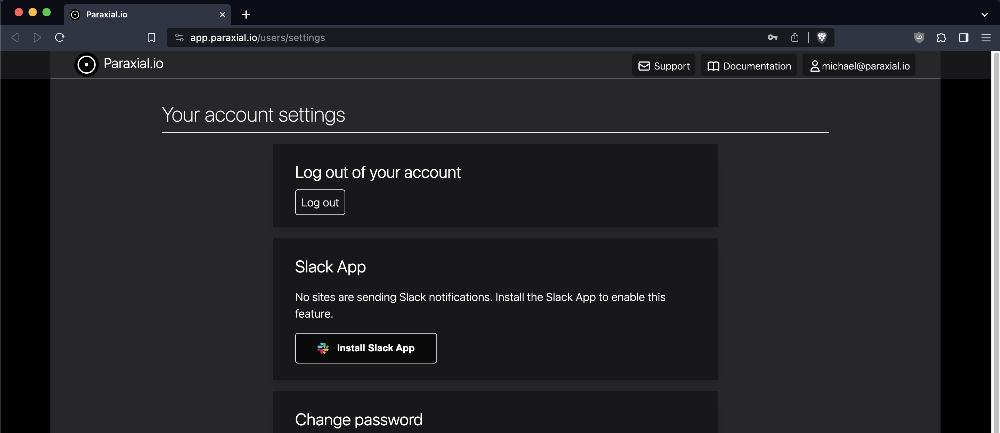
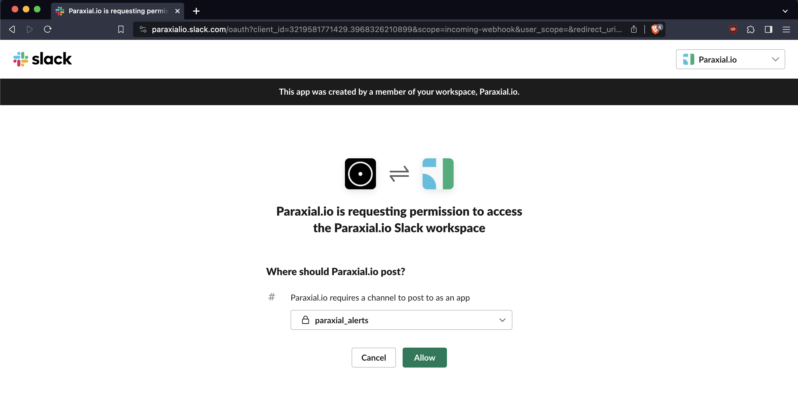
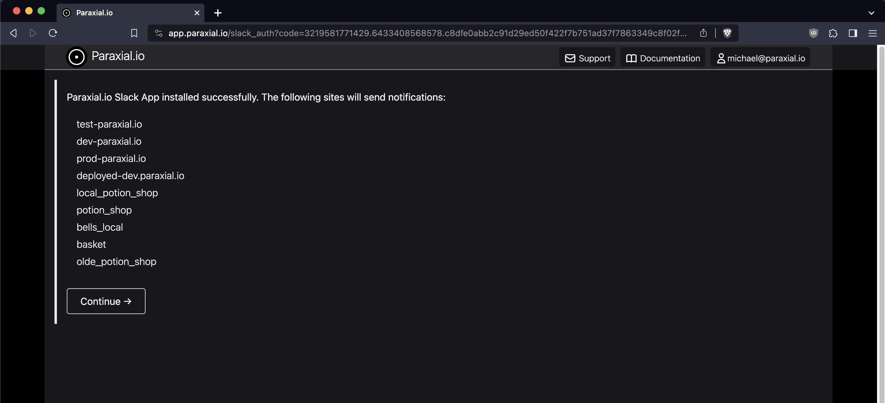
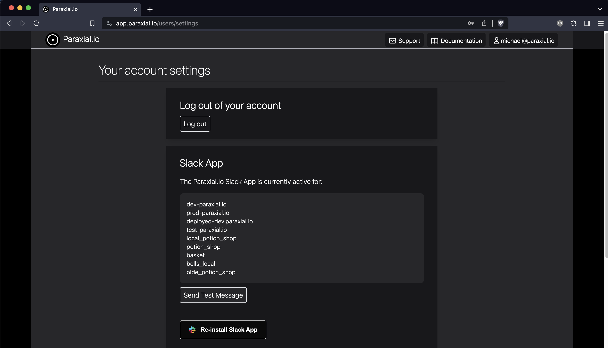
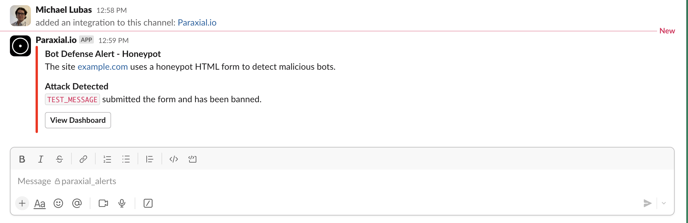

# Slack App

## Alerts

The Slack App alerts on the following:

1. IP Bans to a rule match. For example, `IP sent > 5 requests in 10 seconds to /users/login`

2. IP Ban due to a honeypot form being submitted. 

3. Exploit Guard triggered (monitor or block mode). 

4. Network Scan completed. 

## Install

You will need permission to approve apps in your Slack workspace. Before installing the app, create a new channel where the alerts will be sent. The channel is named `paraxial_alerts` in this example

Before installing, ensure the Paraxial.io user doing the install is a `site admin` on all sites you want to receive alerts for. If you are only a `site user`, that site will not send Slack notifications. This information is available in "site settings". 

## Install

### 1. User Settings

### 2. Add to Slack

### 3. Successful Install

### 4. User Settings

### 5. Test Message Sent Successfully 

